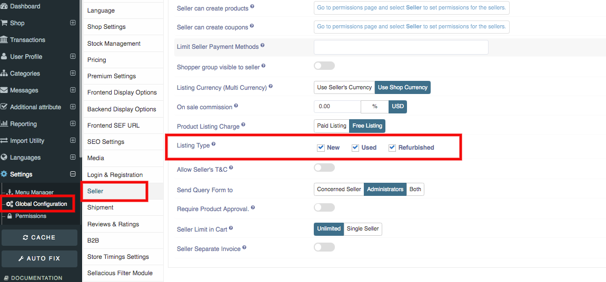
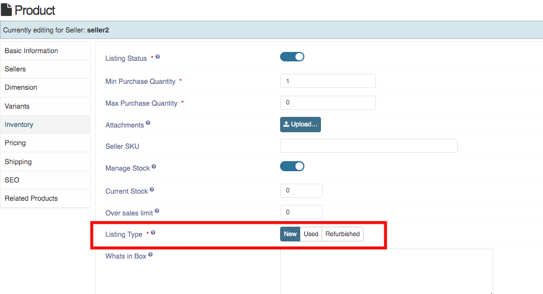

**There are three listing type:** New, Used and Refurnished. Used products means to sell the used products. Refurbished means the renewed product. You can list the products according to the types. You can set the listing type from the global configuration on the sellacious panel.

1. Go to the sellacious admin panel.
2. Go to the **Settings->>Global Configuration** from the drop down menu.
3. Go to the seller tab then select the listing type you want to add in your store.
4. For creating the listing type for the seller, Go to the shop then select the product catalogue from the drop down menu.
5. You can apply the listing type while creating the product. In the inventory tab, select the listing type you want to use for the particular product.
6. Click on the save button to save the details of the isting type of your product. 
7. listing type and item condition will be shown on frontend details page.

