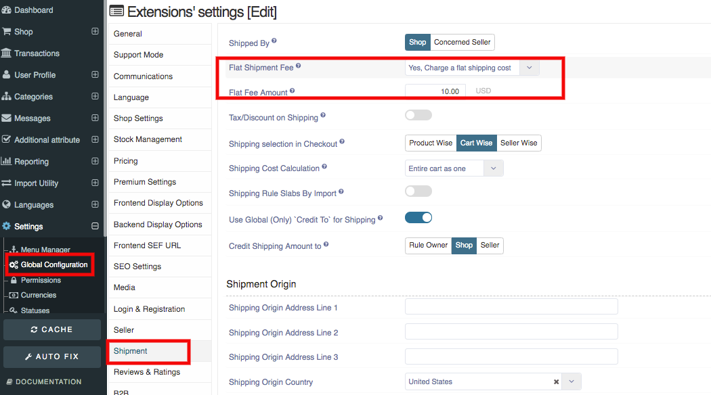

The process of transporting an item, usually through the mail. Shipping is a very basic, common way of getting an item from one place to another, or from one person to another.

**Shipping rule:** Using Shipping Rule you can define the cost for delivering the product to the customer and also to the supplier. You can define different shipping rules or a fixed shipping amount for the same item across different territories.

**To create a product with shipping rules follow, these steps:**

1. Go to the sellacious panel of your website.
2. For adding product shipping rule to your product, go to Shop->>Shipping Rules from the drop-down menu.
3. Create new product, click on new button.
4. Go to Shipping tab from the left side menu.
5. Fill the information about the Shipping rule in different sections available in the shipping tab.
6. Click on save button to save the Shipping rule details.
7. The Shipping rules of that product are successfully added. 
8. You can set the shipping rules for products through shipment options in Global Configuration.

**Set the flat shipping fee:**

A flat fee, also referred to as a flat rate or a linear rate, refers to a pricing structure that charges a single fixed fee for a service, regardless of usage. Less commonly, the term may refer to a rate that does not vary with usage or time of use.
 
1. Go to the sellacious panel of your website.
2. For applying flat shipping fee to your shop.
3. Go to Setting->>Global Configuration from the drop-down menu.
4. Click on the Shipment tab, Select the charge a flat shipping.
5. You can charge the flat shipping cost and enter the flat shipping amount.
6. Click on save button to save the Flat shipping details, the Flat Shipping rule is successfully added.

