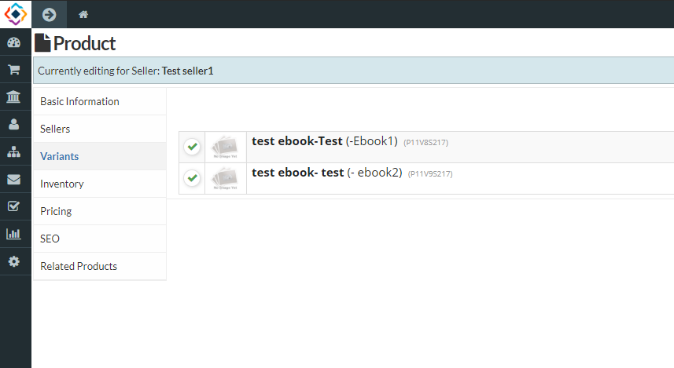

**Variants represents the same product with different features. **

* If **product** comes in more than one option, such as size or color. Each combination of options for a product is a **variant** for that **product**.
* You can set the variants from product catalogue in sellacious panel. 
* After creating a new product, you can add variants.

**To Create variants in a new product:** 
1. Go to the sellacious admin panel.
2. Go to shop, select product catalogue drop the drop down menu.
3. Create new product, fill the details.
4. Save it.
5. Reopen the created product, variant field will be added.
6. Select the variant field.
7. Click on the add variant button to add the variants for your product.
8. Click on the save button, Variants of new product will be created.

**Add variants to the available product:**
1. Go to the sellacious admin panel.
2. Go to shop, select product catalogue drop the drop down menu.
3. Select the product of which you want to create variants.
4. After opening that product, select variant field.
5. Click on the add variant button to add the variants for your product.
6. Click on save button, Variants of that product will be created.

