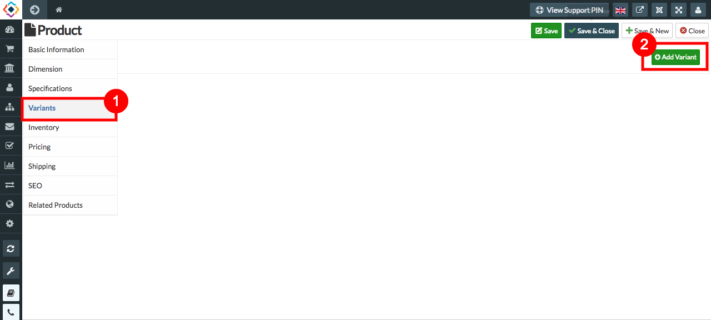
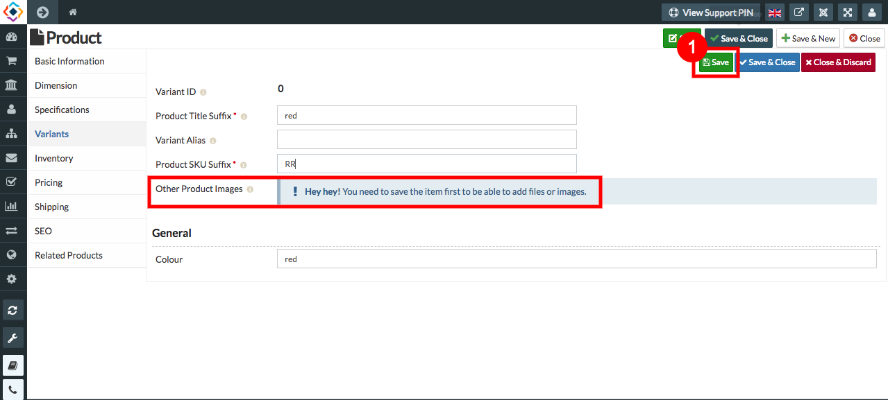
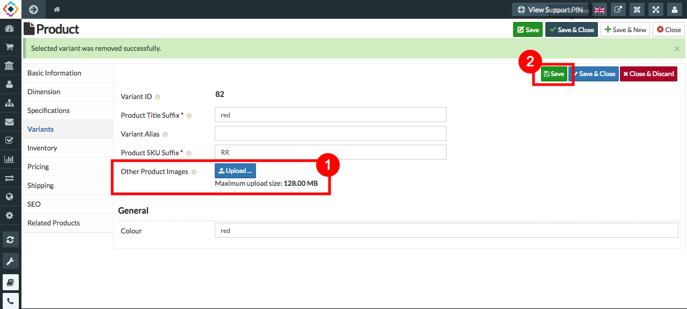

**TO UPLOAD IMAGES FOR THE VARIANTS, FOLLOW STEPS:**

1. Go to sellacious admin panel.
2. Go to shop, select product catalogue from the drop down menu.
3. Create a new product and save it, because you can create variant after saving or creating the product.
4. Reopen the product, select variant menu from the left.
5. Click on add variant to create variant.

6. Fill the credentials.
7. You need to save the item first to upload images and files.

8. Save the item.
9. Open the saved product.
10. Upload the image. 
11. save it.

12.And image of your variant will be saved.
