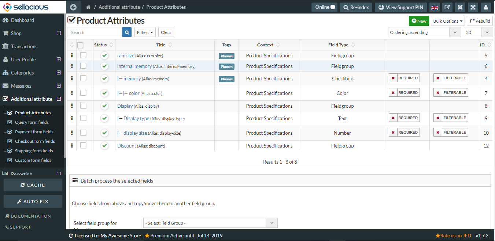

**Variant Specification** is to identify variants of the product precisely .
It is a detailed description of the design and materials used to making the variants.

To add variant specifications, follow steps:
1. Go to the Sellacious admin panel.
2. Create Atributes of specifications you want to add with your variants from Additional Attributes>>Product attributes

4. Go to categories, select categories type from the drop down menu( For eg. Physical Product).
5. Select a category to add variant specifications in that category.

4. Go to Custom Field section on the left.
5. On the bottom there will be one variant field, add specification you want to add for that category.
6. Click on save button.

7.Variant specification will be added.