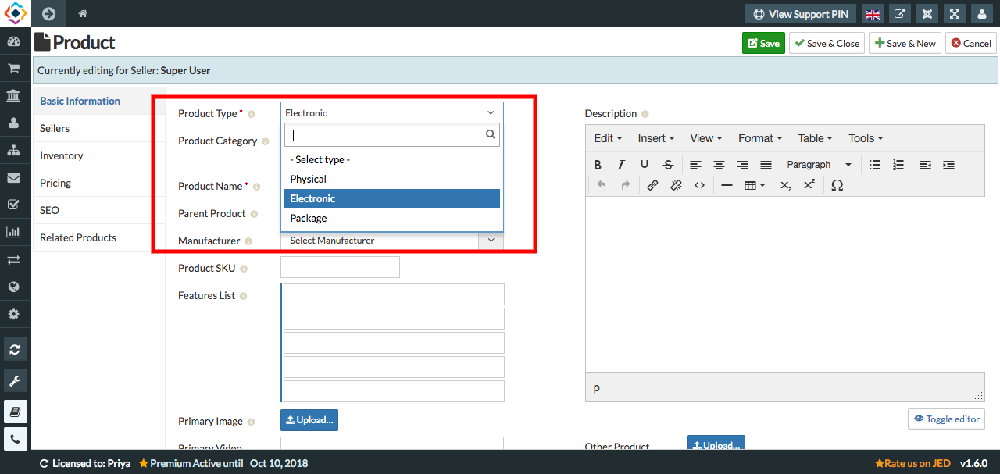

**E-products** are the electronic products i.e, E-Books. Tick the file types you want to upload, it can be an image, a Document, Archive, audio and video. E-Products allows you to sell products such as MP3's, e-Books, PDF, and just about any type of digital file. 

**To create E-Products, follow steps:**

1. Go to the Sellacious panel of your website.
2. Go to Shop->>Product Catalogue from the drop-down menu.
3. To create a new e-product, click on New button.
4. In Product type, select Electronic.

5. Fill the information about the e-product in different sections available in the Product window.
6. Click on Save button to save the e-product details, the product is successfully added.
