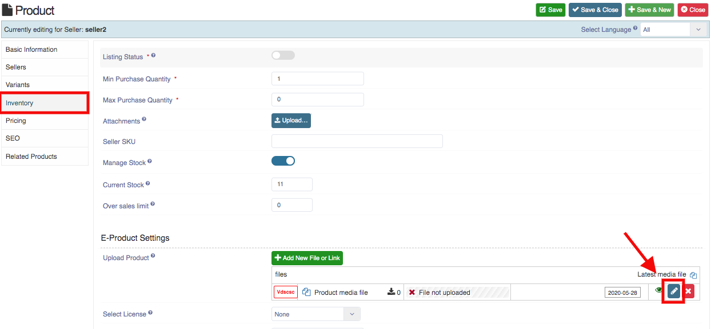
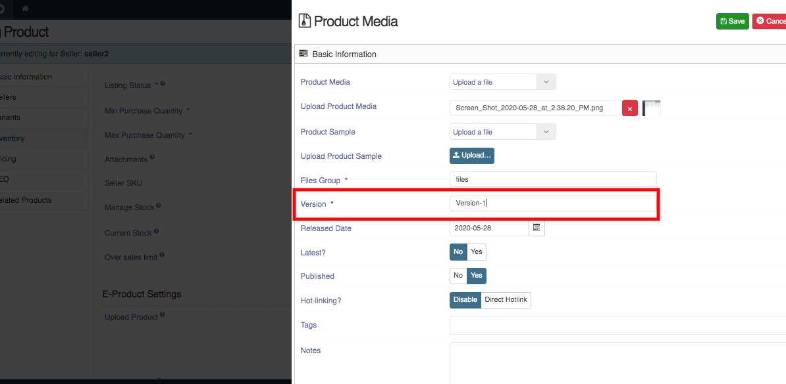

**Edited By:** Rashi Gupta
**Date:** 29-05-20

**You can add or edit the version of the Electronic Product by the following steps:** 

1. Go to the Sellacious panel of your website.
2. For Checking the version of the Electronic Product, go to Shop.
3. Select Product Catalogue from the drop-down menu.
4. To create a new product, click on new button.
5. In Product type, select Electronic.
6. Fill all required details related to product and save.
7. After saving, open the product and go to Inventory tab.
8. In E-Product Setting->Upload Product column, click on add new file or Link.
9. After uploading file, click on edit button.
10. In the product media window, you can set a version for that product or you can the change the version of that product.

12. You can check or edit the file version from here and save.
13. Click on the save button to save the product details.