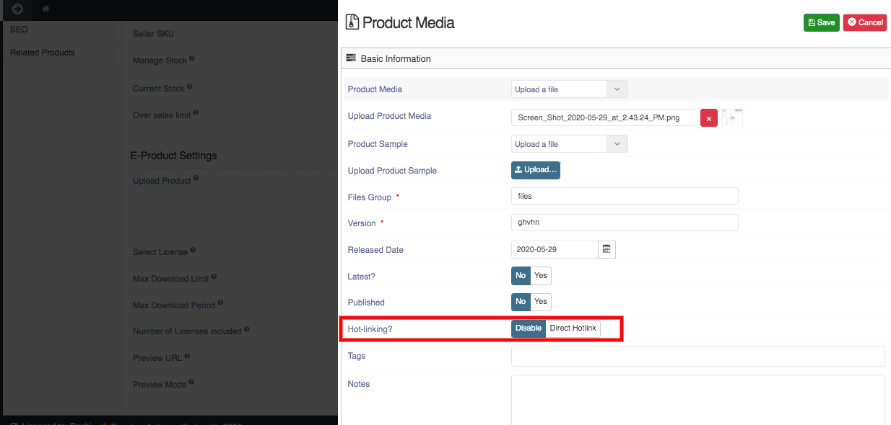

**Hotlinking** is a process when a direct link to some media (image, video, audio file, etc) is being shared instead of a full website page where it is actually hosted. 

The **Hotlinking** of the software is the direct download link in which no one have to purchase the download.

**To set the Hotlink Of an Electronic-Product, follow the steps:**

1. Go to the Sellacious panel of your website.
2. For Checking the File version, go to Shop.
3. Select Product Catalogue from the drop-down menu.
4. Create a new product by clicking on new button.
5. Select product type Electronic.
6. Save the product.
7. Open the saved Product.
8. Go to the inventory tab, on uploaded product you can set the **Hotlinking** as 'Disable' or 'Direct Hotlink'.

9. Click on the save button to save the details.