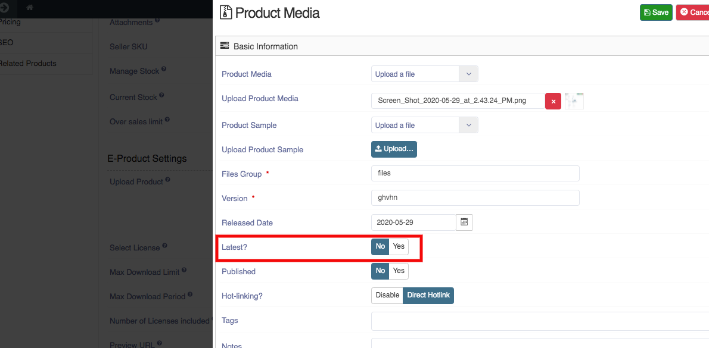

* It is used to mention whether the product is latest or not. You can declare a product latest by selecting 'yes' or 'no' option.
* It is mentioned when the Product type is electronic.

**To make a Product latest or not,follow steps:**

1. Go to the Sellacious panel of your website.
2. For Checking the File version, go to Shop.
3. Select Product Catalogue from the dropped down menu.
4. Create a new product by clicking on new button.
5. Select product type- electronic.
6. save the product.
7. Open the saved Product.
8. Go to the inventory tab, click on the add new file or link.
9. Product media window is open and here you can set Latest as 'Yes' or 'No'.

10. Click on the save button to save the details.