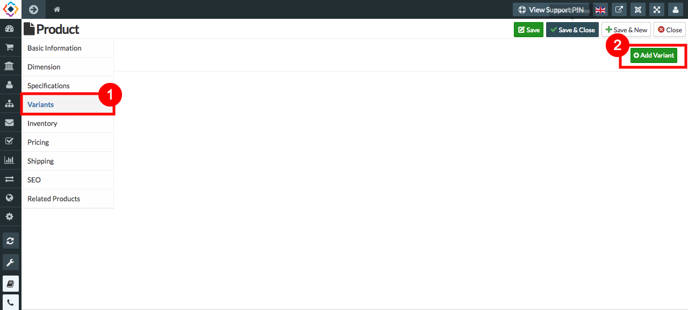
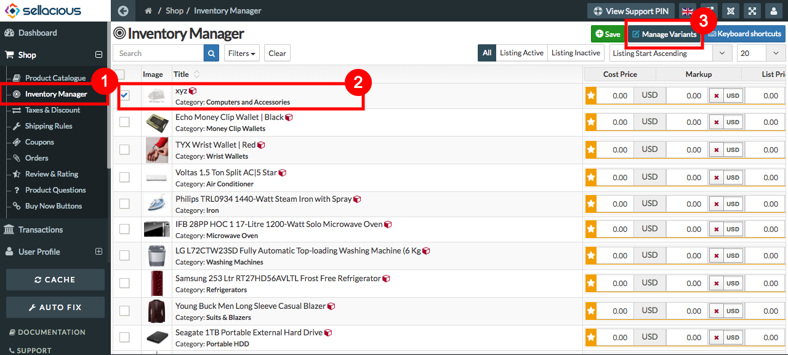
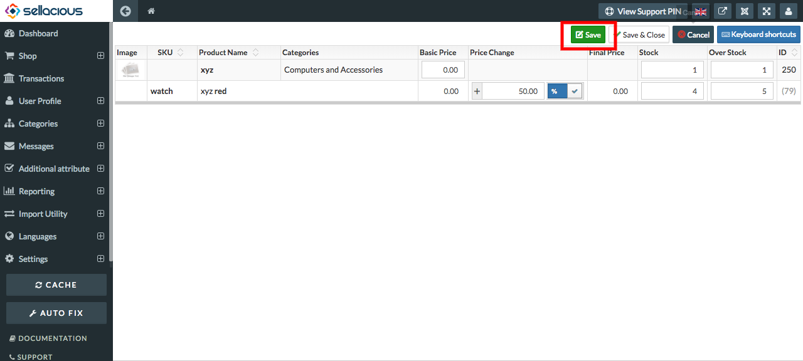
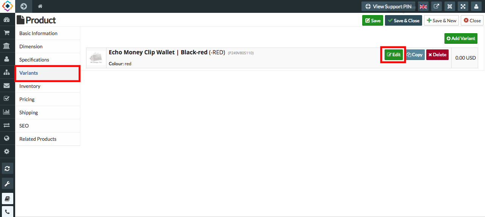
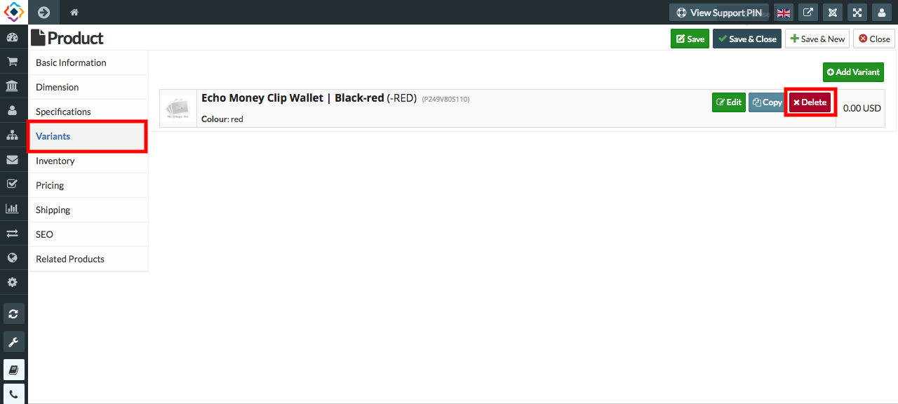

**TO ADD A VARIANT IN A PRODUCT, FOLLOW STEPS:**
 (YOU CAN ADD A VARIANT ONLY AFTER SAVING THE PRODUCT)

1. Go to sellacious admin panel.
2. Go to shop, select product catalogue from the drop down menu.
3. Create a product, save it.
4. Reopen the product, select variant menu from the left.
5. click on **add variant**.

6. Fill the credentials.
7. Select save to save the variant details.
8. And your variant is added to yor product.

**TO MANAGE VARIANT, FOLLOW STEPS:**

1. Go to sellacious admin panel.
2. Go to shop, select **Inventory Manager** from the dropped down menu.
3. Select the product, whose variant you want to manage.
4. Click on **Manage Variant** at the top.

5. Through Inventory Manager you can only manage the stock and price of the variant.
6. Fill the credentials.
7. Click on save button.

8. Your variant will be managed.

**TO EDIT VARIANT, FOLLOW STEPS:**

1. Go to sellacious admin panel.
2. Go to shop, Select product catalogue from the drop down menu.
3. Select the product, whose variant you want to edit.
4. Select variant menu from the left.
5. Click on edit.

6. Make the changes.
7. Save the editing.

**TO DELETE VARIANT, FOLLOW STEPS:**

1. Go to sellacious admin panel.
2. Go to shop, Select product catalogue from the drop down menu.
3. Select the product, whose variant you want to delete.
4. Select variant menu from the left.
5. Click on delete.

6. click **sure?** to delete.
7. And your variant will be deleted.
