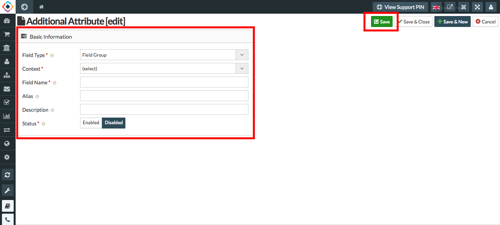

**Additional Attributes** allows you to store any additional information about your items that is not captured by the default Fields. These attributes appear as fields in the item detailed screen.

In **Additional attribute** field a user can add number of additional fields.
User can add the additional attribute for the products, profile, Query form, Payment form, Checkout form and shipping form. 

**TO CREATE ADDITIONAL FIELDS, FOLLOW STEPS:**

1. Go to the sellacious admin panel.
2. Go to Additional Attribute menu from the left menu bar.
3. Select the Field where you want to add a field. 
4. Click on the new button to create new attribute.

5. fill the credentials in the Additional Attribute Fields.
6. Click on the save button to save the details.

7. And additional attribute is created.