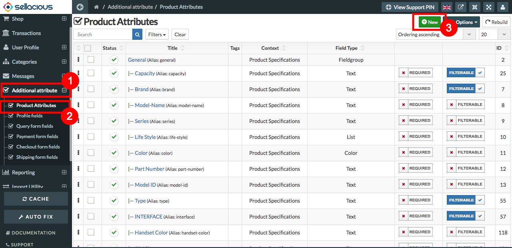

A **Product Attribute** is a characteristic that defines a particular product and will affect a consumer's purchase decision.
In Product attribute field a user can create the custom or additional fields for the products.

**TO CREATE ADDITIONAL ATTRIBUTES FOR PRODUCTS, FOLLOW STEPS:**

1. Go to the sellacious administartor.
2. Select **Additional Attribute** menu from the left menu bar.
3. From the drop down menu select **Product Attribute**.
4. Click on New button, To create a new attribute.

5. Fill the information about the product attributes in different sections.
6. Click on Save button to save the product attribute details. 

7. And product attribute is successfully added.