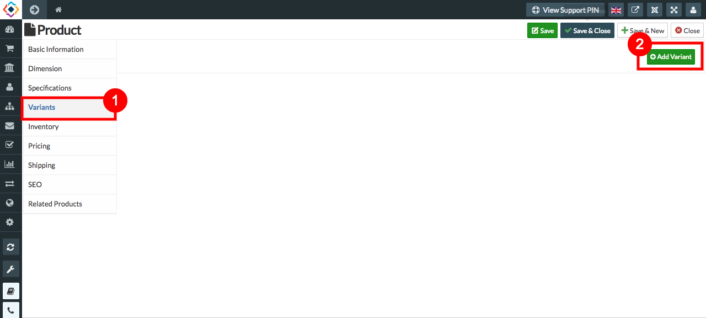
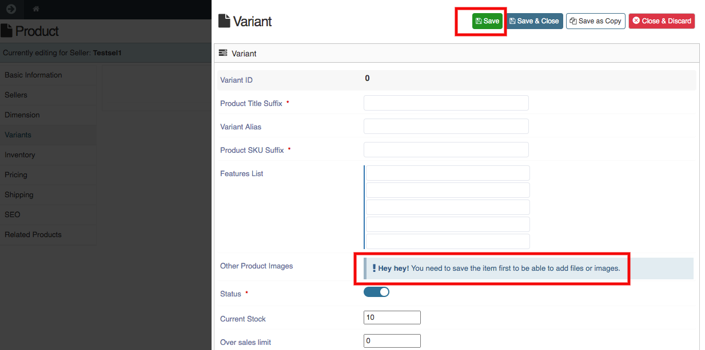
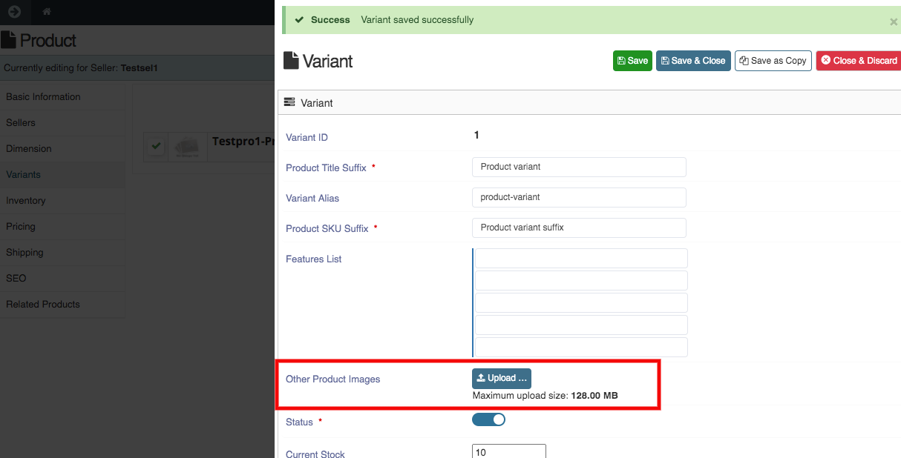

**TO UPLOAD IMAGES FOR THE VARIANTS, FOLLOW STEPS:**

1. Go to sellacious admin panel.
2. Go to Shop->>Product Catalogue from the drop-down menu.
3. Create a new product and save it, because you can create variant after saving the product.
4. Reopen the product, select variant menu from the left.
5. Click on add variant to create variant.

6. Fill the credentials. 
7. You need to save the variant first to upload images and files.

8. Save the Variant.
9. You will get option to upload other product images.
10. Upload the image

11. Save the variant and image of the variant will be saved.
