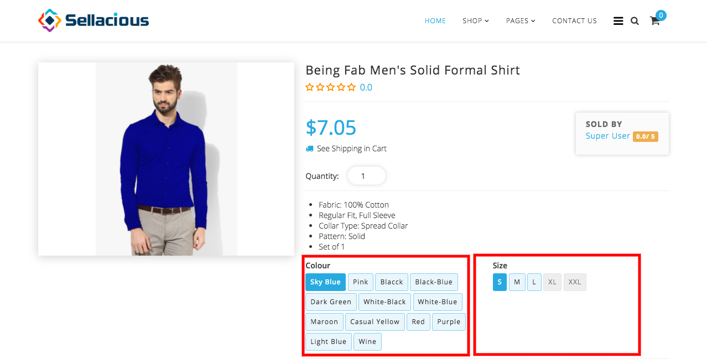
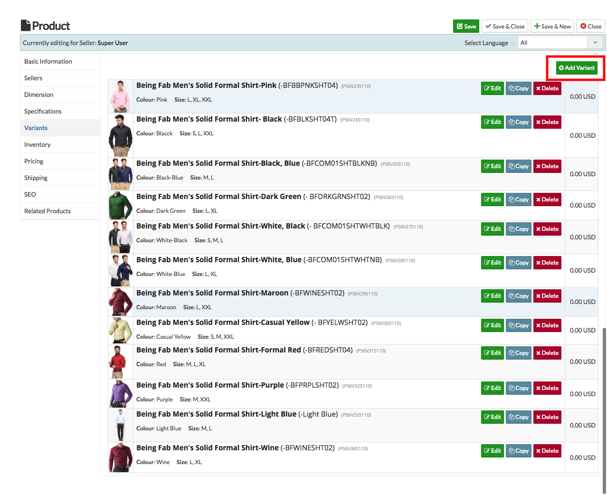
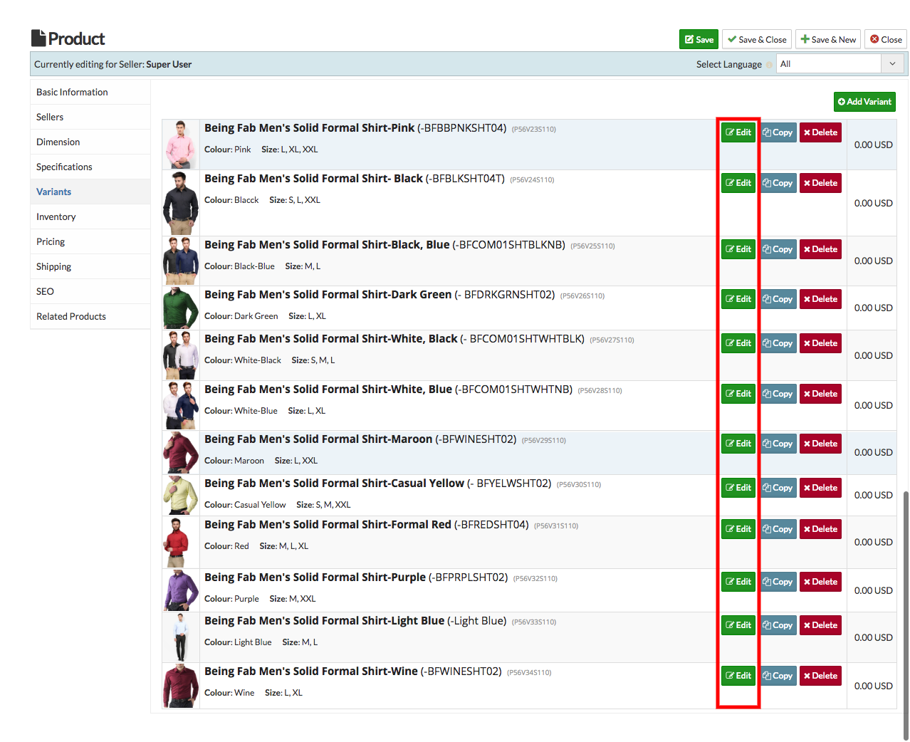
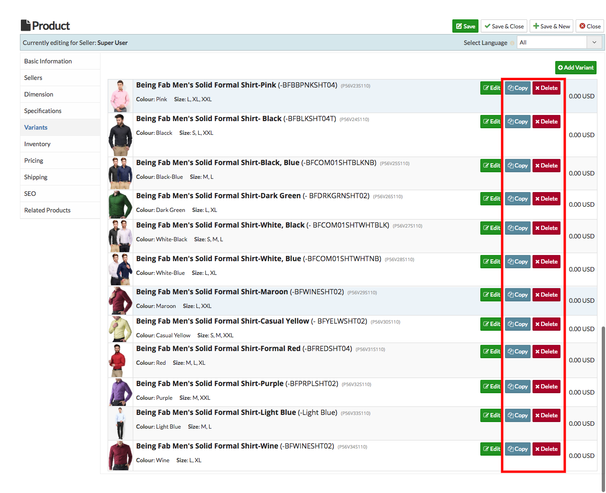

A specific item that is bundled in with related variants to form one distinguishable product is known as a product variant. Product variants have unique identifiers, such as price, and every variant is based on the same product definition.

##### **Below there is a product having different variants :

* **Different variants are created for this product:** 
* **If you want to create a new variant for the product, click on add variant.** 
* **Create variants with unique Identifiers - price, size, coloue etc.**

* **To edit the created variants, Click on edit button to edit the variant.**

* **User can delete or copy the created variant.**

