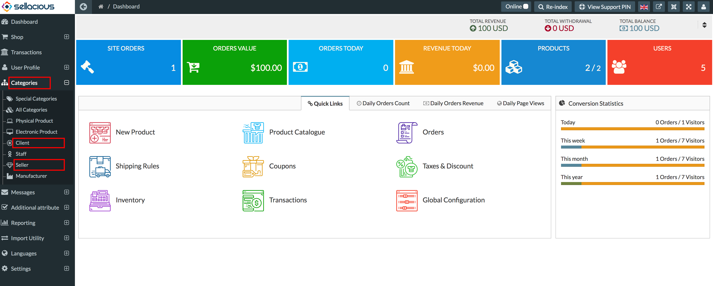
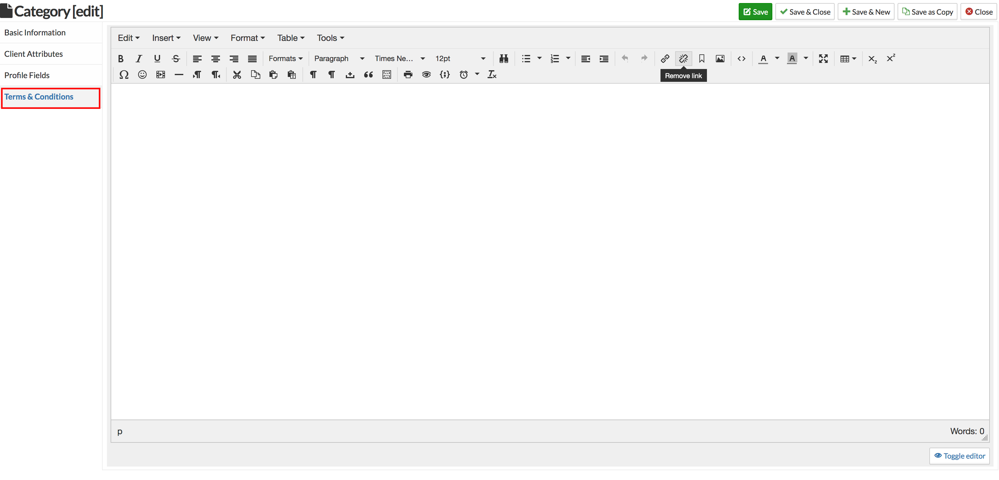
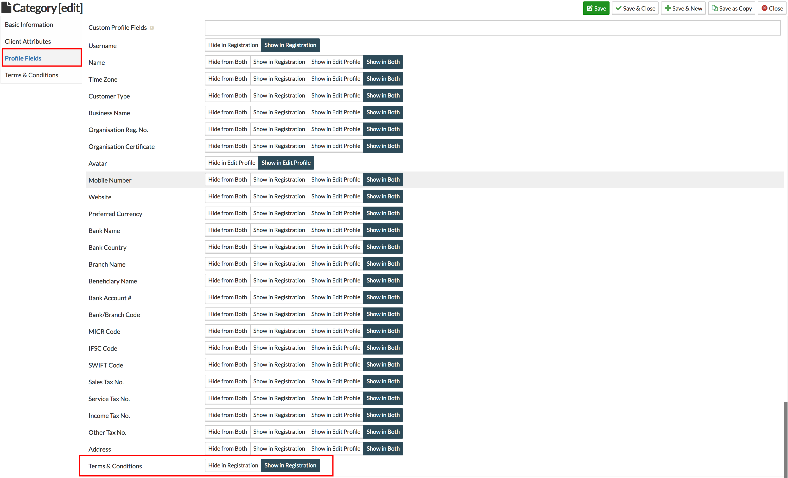

Sellacious has a feature to include terms&conditions before the user/seller registration. You can describe your terms and conditions for the user/seller category.

To submit the t&c for Client/Seller category, go to the sellacious backend of your site. Now, go to Categories and select the category type (Client/Seller) for which you want to add the terms & conditions.

Open the Terms & Conditions and submit the text.

---

If you don't want to use t&c, you can hide them from Sellacious Backend > Categories > Client/Seller > Profile Fields. Select in Terms & Conditions 'Hide in Registration'.

