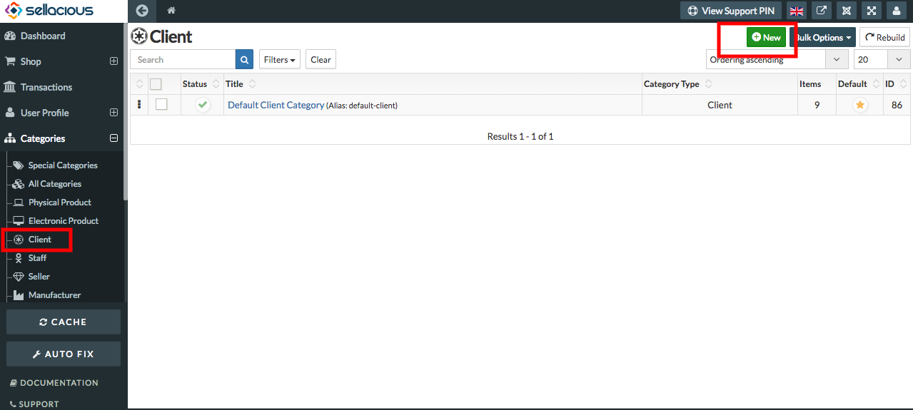
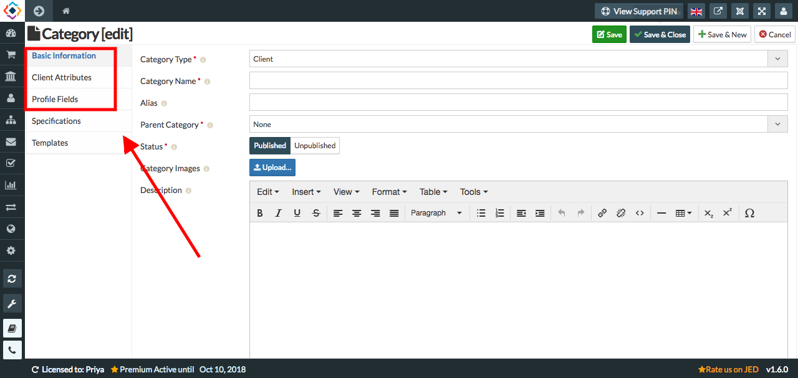

**Client category** is the section in which we can create a new client from the backend of sellacious.

**To create a new client, folow the steps:**

1. Go to the sellacious panel of your website.
2. Go to categories and select client category from the dropped down menu.
3. To create a new client, click on new button.

5. Fill the information Of the new client.

*  **Basic information:** You can set the basic information of the category by Type,Name,Category and status.   
*  **Client attributes:** You can set the client attributes from the client attributes tab. Set the user  
                             permissions, price markup. 
*  **Profile Fields:** You can set the profile fields.
 
 
 
6. Click on save button.
7. New Client is created and information regarding the client will saved.
