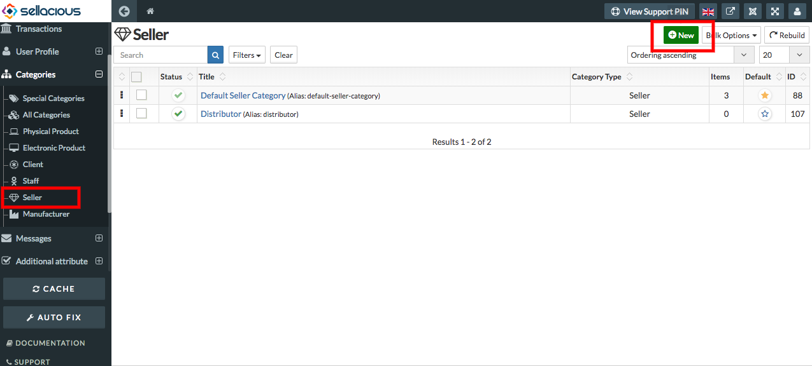

**To add new category in Seller category type,follow steps:**

1. Go to the sellacious panel of your website.
2. For creating Seller, go to categories and select seller categories from the dropped down menu.
3. To create a new seller categories, click on new button.

5. Fill the information about the category.
*   Basic information: You can set the basic information of the category by Type,Name,Category and status.Category       type will be seller because here we are creating a new category in seller.
*   Client attributes: You can set the client attributes from the seller attributes tab.Set the user permissions,       price markup. 
*   Profile Fields: You can set the profile fields.

6. Click on save button.
7. And the new seller categories detail is successfully added.
