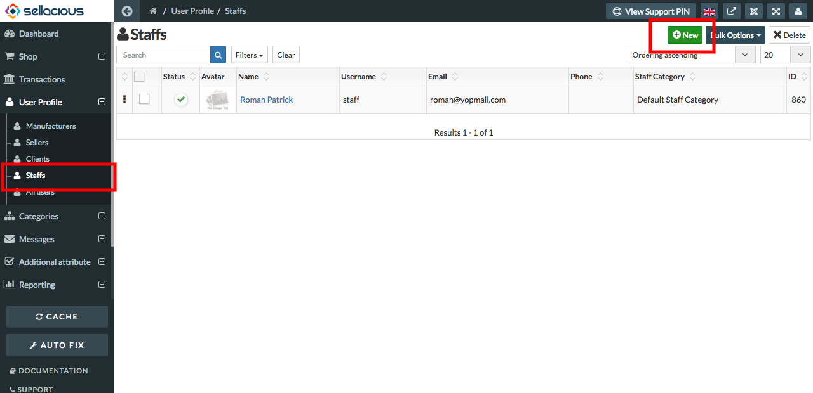
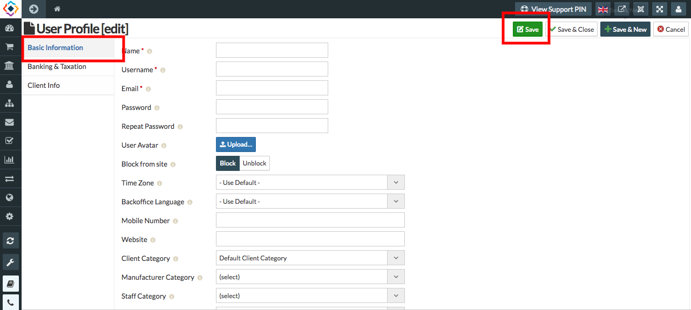

* **Staff** is a group of persons, as employees, charged with carrying out the work of an establishment or executing       some undertaking.
* In **Staff Category** you can create different categories of staff.

**To create Staff Category, follow steps:**

1. Go to the sellacious panel of your website.
2. Go to  categories and select staffs from the dropped down menu.
3. To create a new staff categories, click on new button.

4. Fill the information/credentials in the basic information.

5. Click on save button.
6. The new Staff categories is successfully added.
