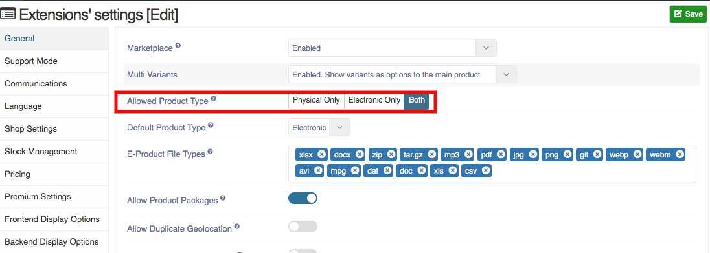

**You can create the package:**

1. Go to the sellacious panel of your website.
2. Go to Shop->>Product Catalogue from the drop-down menu.
3. To create a new package, click on new button.
4. On the basic information tab, select the product type as package.

5. On the left tab select product package.
6. Select the products you want to add in the package.

7. click on save button to save the product package details, products in the package successfully added.

**You can set the package:**

1. Go to the Settings from left menu.
2. Select Global configuration from the drop-down menu.
3. On the general Tab, Select the Allowed product type as 'Both'.

4. Click on the save button to save the details.
5. And You can create a package.