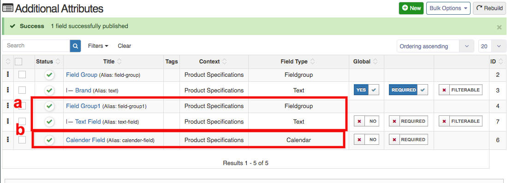

A **Product Attribute** is a characteristic that defines a particular product and will affect a consumer's purchase decision.
In Product attribute field a user can create the custom or additional fields for the products.

**TO CREATE ADDITIONAL ATTRIBUTES FOR PRODUCTS, FOLLOW STEPS:**

1. Go to the sellacious administartor.
2. Select **Additional Attribute** menu from the left menu bar.
3. From the drop down menu select **Product Attribute**.
4. To create a new attribute, click on New button. 

5. You can create product attributes by 2 ways:
	a. With field group
	b. Without field group.
**a. With field group:** First you need to create a field group, click on new button to create field group. In field type, select field group and enter your field name and save.
   
   After that, create new product attribute and select field type accordingly. Then select your field group and fill needed information accordingly.
   
**b. Without field group:** In this, just create product attribute and select your field type without selecting field group.
   
   
   