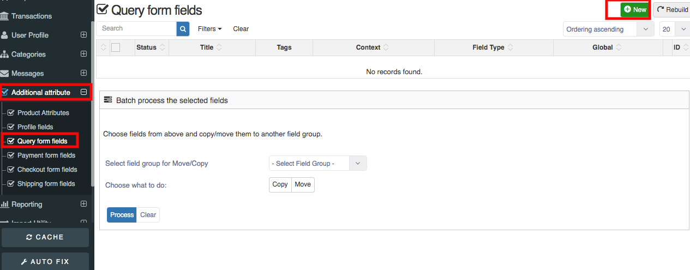
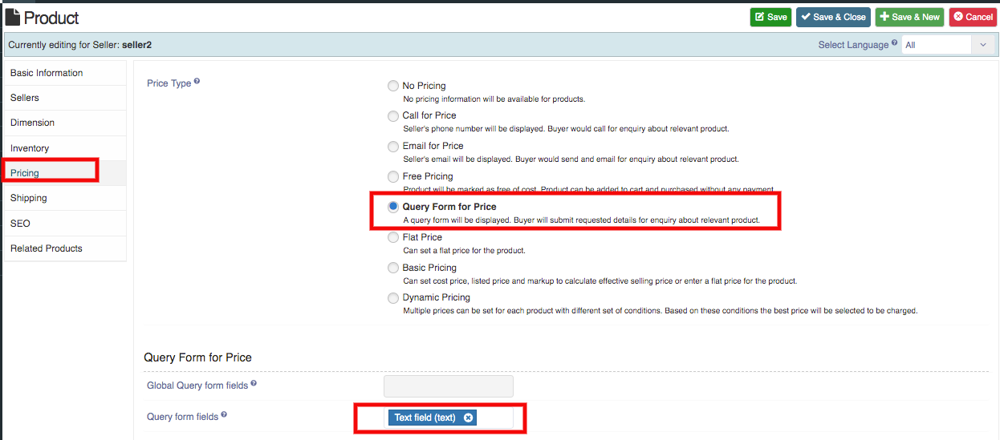

* **Query Form is a form by which customers can ask any query related to products.**

##### **How To Create Query form fields**
1. Go to Sellacious panel of your website.
2. From the left menu, go to the **Additional attribute->>Query form fields**.
3. Now click on a new button to create new query form field.
4. Now select your field type and fill all the required details and save.

5. Query form field is created.

##### **How To use Query Form field:**
1. From the left menu, go to the **Shop->>Product Catalogue**.
2. Now click on the new button to create new product.
3. Enter your basic information of your product and click on pricing tab.
4. In pricing tab, select the query form for price type.
5. From the bottom, select your query form field from the bottom query form field option.
6. In product detail page, you can see submit query button.
7. To open the query form, just click on the submit query button.
