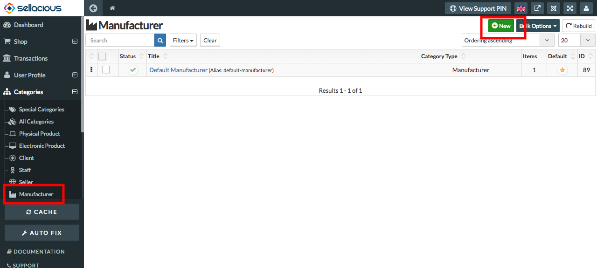
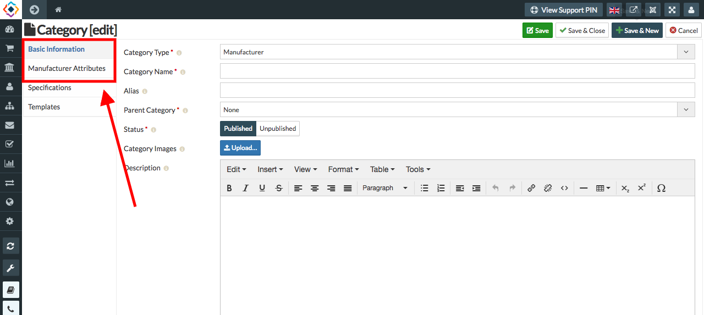

**Manufacturer** is a Entity that makes a good through a process involving raw materials, components, or assemblies, usually on a large scale with different operations divided among different workers.

**Manufacturer category is a category in which we can create a new manufacturer.**

**To create a new Manufacturer, follow steps:**

1. Go to the sellacious panel of your website.
2. Go to categories and select manufacturer from the dropped down menu.
3. To create a new manufacturer, click on new button.

5. Fill the information of Manufacturer.

* Basic information: You can set the basic information of the category by Type,Name,Category and status.
* Manufacturer Attributes: You can set the manufacturer attributes from the manufacturer attributes tab.Set the user   permissions, price markup. 

6. Click on save button.
7. New Manufacturer is creted and information regarding the manufacturer will saved.
