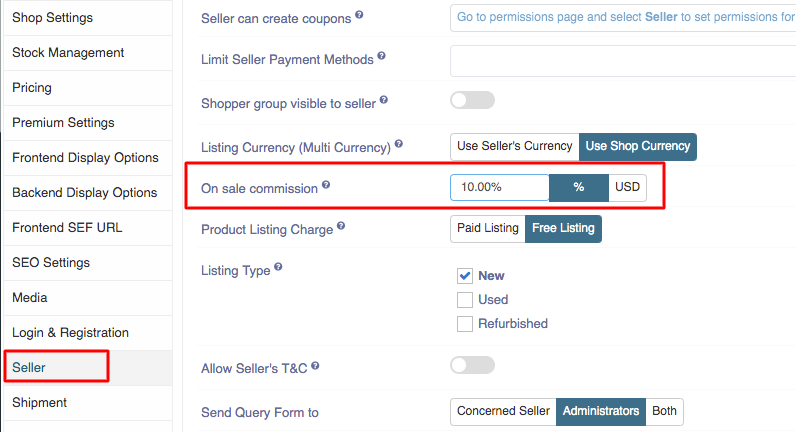

**Written by**: Rashi Gupta
**Date**: 03-08-2020
**Compatibility**: Sellacious v2.0.0-Beta1+

There are three ways to set the Seller Commission:
1. From Global
2. From Category (seller/product)
3. From Seller profile

**1. From Global:** From global configuration, you can also save commission. How much commission does a seller pays to shop owner on each product sale made. 
**Note**: this commission is applied on per item basis.

* Go to the Settings-> Global configuration
* In the seller tab, you can found On sale commission

* Enter the commission number and saved it. 
* This commission amount will deduct from the seller account and credit to the owner account.

**2. From Category (Seller/Product):** We have seller commission field to mamage seller comission from the category i.e. by seller/product category. To add the seller comission, you can add either from seller category or from product category.

*  Go to the left menu-> Categories.
*  Open the seller category and click on seller attributes tab.

* Click on the manage commission button, commission drawer will open from left side.

* Enter the seller commission in product categories and save it.
* Open the product category and click on seller commission tab.

* Click on the manage commission button, you can see the same commission amount as you have entered in seller category for product category.

Seller category and product category commissions are vice versa. Whatever commission is decided in any category like product or seller, it will refelect in other category.

**3. From Seller Profile:** Also, seller commission will also define from the seller profile too. Whatever commission is define in seller profile, it will be on first priority than seller/product category.

* Go to the seller profile and edit the profile.
* Click on the seller commission tab in seller profile.
  
* Click on the manage commission button.
 
* From here you can manage the commission, you can enter the diferent different commission for each category.
* Save the seller profile.
* On every purchase, seller commission will deduct and credit to the shop owner account. 

**Note: If commission is define in seller profile, category and global too. Seller profile will be on first priority. If commission is define only in category and global, category will be priority.**