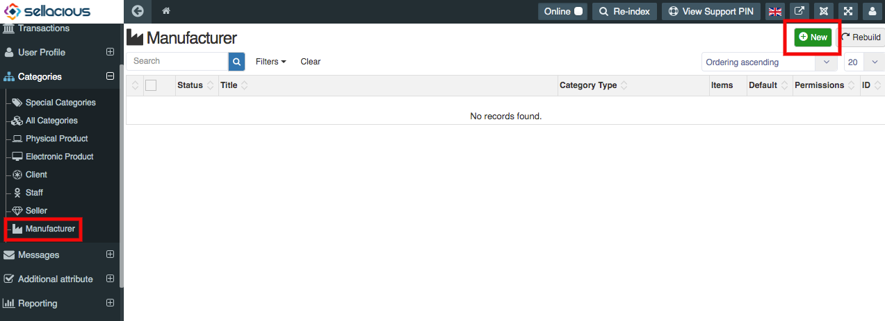

**Manufacturer** is a Entity that makes a good through a process involving raw materials, components, or assemblies, usually on a large scale with different operations divided among different workers.

**Manufacturer category is a category in which we can create a new manufacturer.**

**To create a new Manufacturer category, follow steps:**

1. Go to the sellacious panel of your website.
2. Go to categories and select manufacturer from the dropp-down menu.
3. To create a new manufacturer, click on new button.

4. Fill the information of Manufacturer.

* Basic information: You can set the basic information of the category by Type, Name, Category and status. 

5. Click on save button.
6. New Manufacturer category is creted.
