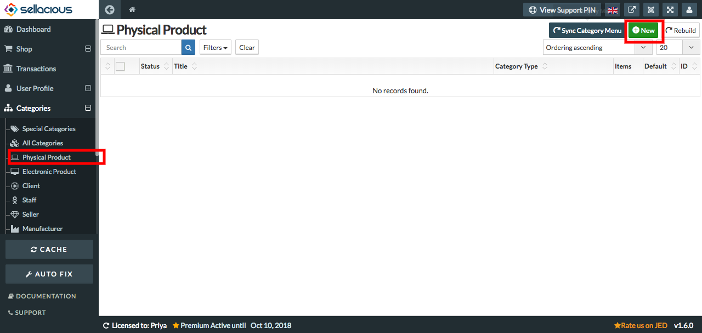
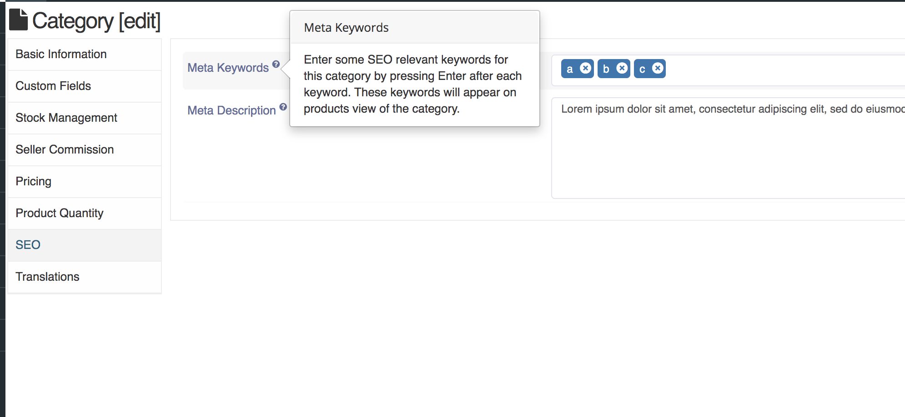
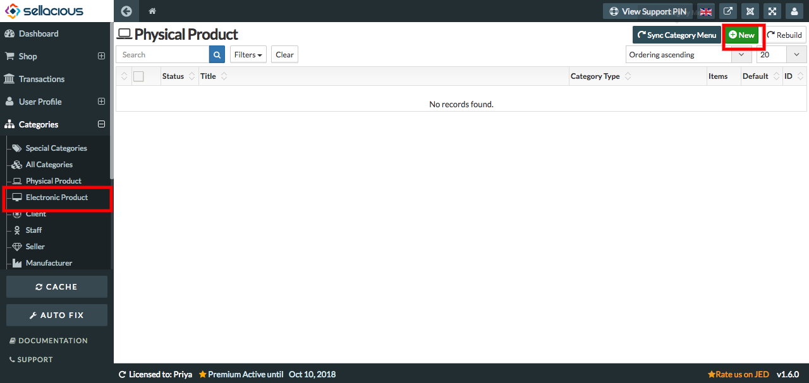

**Product categories**, by Default it has two categories- physical and electronic.Physical products are the products which are physically present like laptop, mobile phones etc. Electronic products are the products which are not present physically like Ebooks etc. 

**To create a new product in Physical Product Category:**

1. Go to the sellacious panel of your website.
2. Go to categories and select phycial product if you want to create a physical product from the dropped down menu.
3. To create new product click on new button.

4. Fill the information about the category.
5. You can add meta keyword and meta description in SEO tab which will sow on category page.

6. Click on save button.
7. Your product is created in that category.

**To create a new product in Electronic Product Category:**

1. Go to the sellacious panel of your website.
2. Go to categories and select Electronic product Category if you want to create an electronic product from the 
   dropped down menu.
3. To create new product click on new button.

4. Fill the information about the category.
5. Click on save button.
6. Your product is created in that category.

