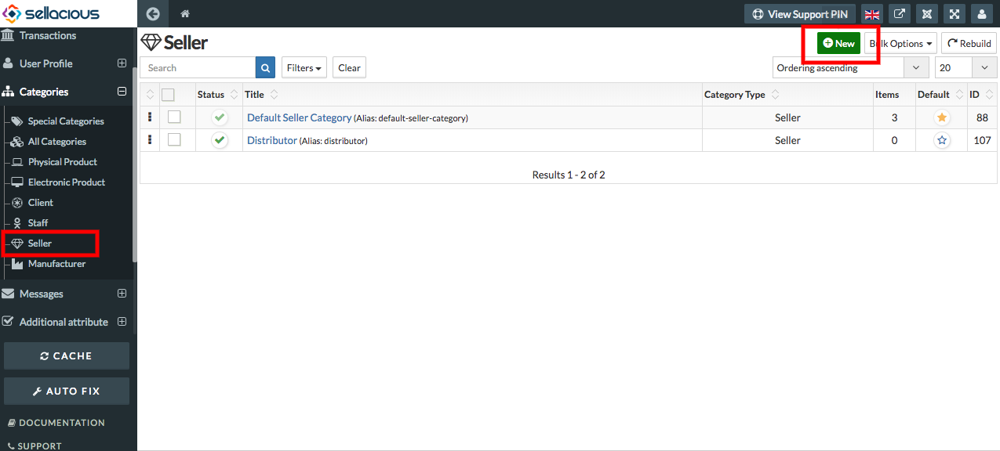
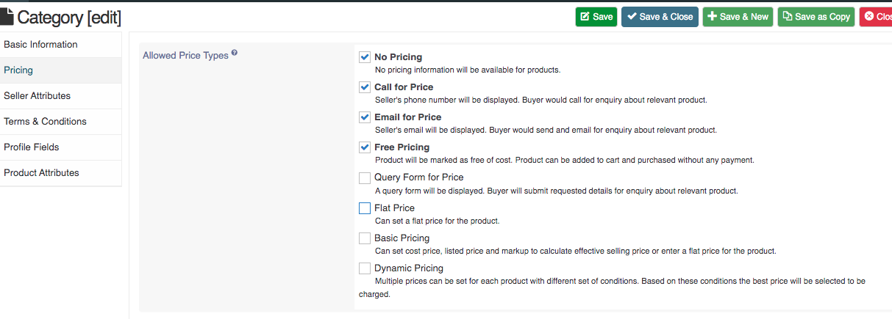

**To add new category in Seller category type, follow steps:**

1. Go to the sellacious backend of your website.
2. For creating Seller category, go to Categories and select seller categories from the drop-down menu.
3. To create a new seller categories, click on new button.

4. Fill the information about the category.
* ** Basic information**: You can set the basic information of the category by Type, Name, Category and status. Category       type will be seller because here we are creating a new category in seller.

* ** Pricing**: You can select the pricing type in seller category for product pricing.

* ** Profile Fields**: You can set the profile fields.

5. Click on save button.
6. And the new seller categories detail is successfully added.
