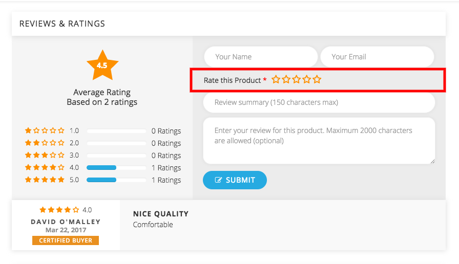

Review and Rating is the detailed list view which is submitted by the customers. It will work when the customers give their reviews and rate the products from the front end.
You can control the review and rating from the global configuration. 

 **Rating**: Rating is the scale which is submitted by the customers based on their satisfaction. If the rating is 1, then the product rating is poor, when the rating is 5 product rating is excellent.

 **Review**: In review section you have to write the summary of the product in the front end. Product reviews are used to give customers an opportunity to rate and comment on products they have purchased, right on the product page. The review of the products are to be listed here.

##### **Listing reviews and ratings**

 **Status**: This column shows whether the product is published or unpublished. The green tick represents the publish status and the red cross represents the unpublish status. by clicking on the circle button you can change the status of the product.
 **Title**: The title of the products are to be listed here with the blue button shown near the laptop is to access to the front end.The title of the product can be change from the product catalogue in sellacious panel.
 **Seller**: This column shows the name of the seller, who is selling the product. It can be a client, manufacturer,etc.
 **Rating for**:  The customer can be rated according to the product, shipping, product, seller. This column represents on what basis the customer is rating for.
**Submitted By:** This column lists the name of the person who submitted the review and rating of the product.
 **Rating:** Rating is the detailed list view which is submitted by the customers.If the rating is of 5 stars then the rating is excellent and 1 stars represented as the poor
 5 Stars represented as Excellent.
 4 Stars represented as Above Average.
 3 Stars represented as Average.
 2 Stars represented as Below Average.
 1 Stars represented as Poor.
 **Review**: This column shows the views given by the Customer on that product
 **Submitted on**: The time when the review and rating submitted by the user. The review and ratings are to be in the format of month day, year and time
 **ID**: The ID number of the review and rating.The ID numbers are the unique numbers which is system generated while creating the review and rating.
