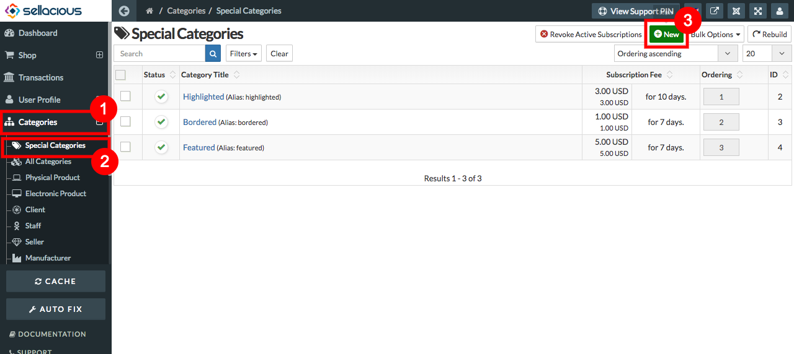
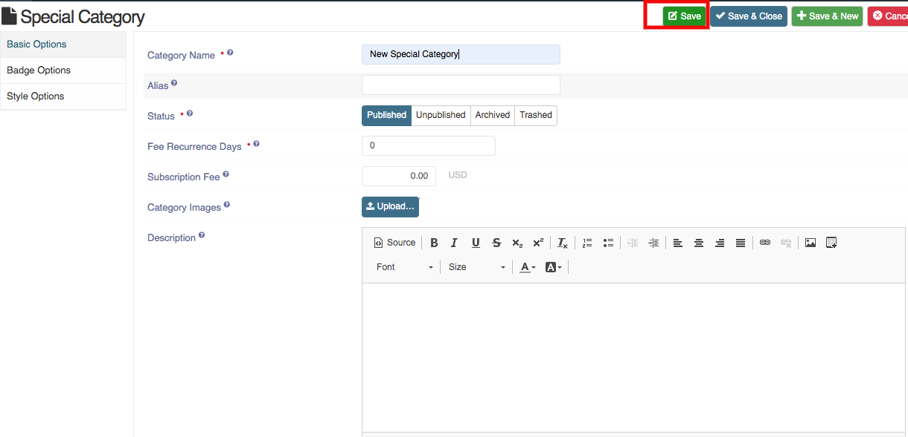
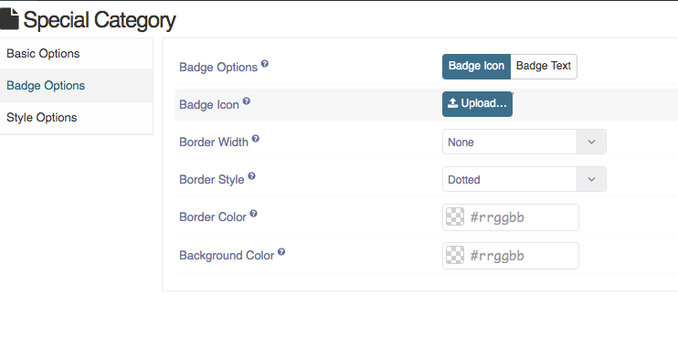
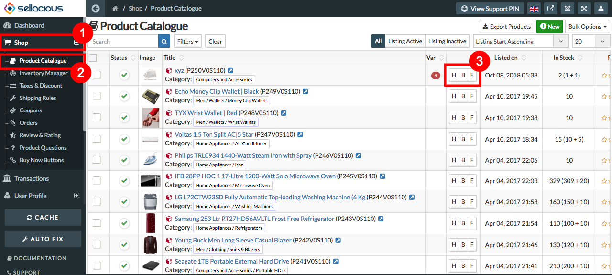

* You can Advertise the products by assigning them to a **Special Category.**
* By Default there are three Special categories in sellacious.
* Default Special Catregories are- Bordered, Highlighted, featured.
* To create advertisement either you can assign the products to default special categories or create a new special
  category and assign products to that new created special category.
  
##### **To create a new special category, follow steps:**

1. Go to the sellacious panel of your website.
2. Go to categories and select special categories from the drop-down menu.
3. To create a new special category, click on new button.

4. Fill the information in basic options 
5. In Badge options, you can set badge icon/text, width, style , color.
6. In style options border style, width, color, background color  
7. Click on save button to save.
8. New **Special Category** is created.

##### **To assign Products to special categories, follow steps:**

1. Go to sellacious panel of your website.
2. Go to shop and select product catalogue from the drop down menu.
3. In product catalogue, there will be a column shows the special catagory.

4. select the special catagory you want to assign the product.
5. And the product will assigned to that Category.
6. In fontend, special category product on product list page.

