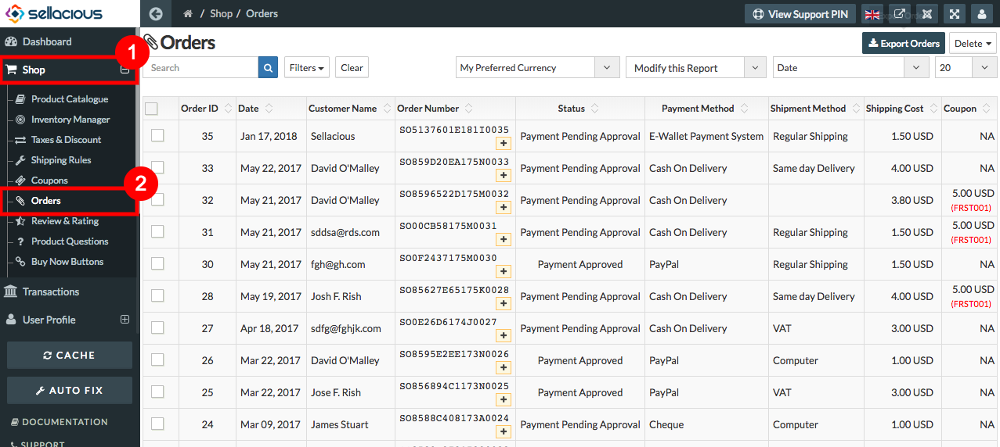
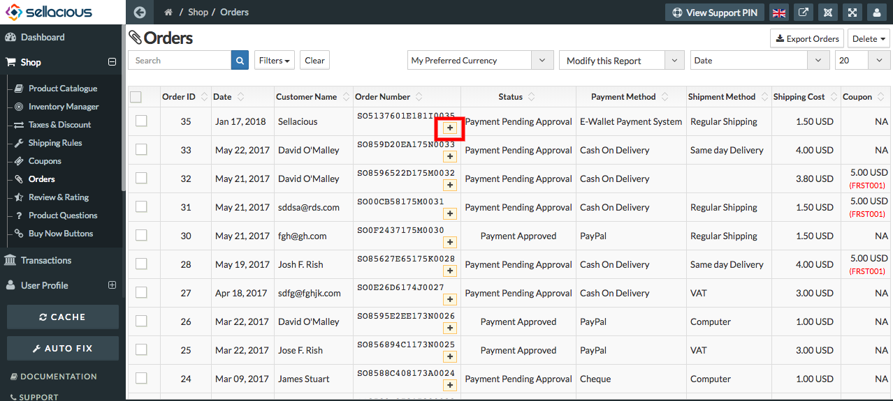
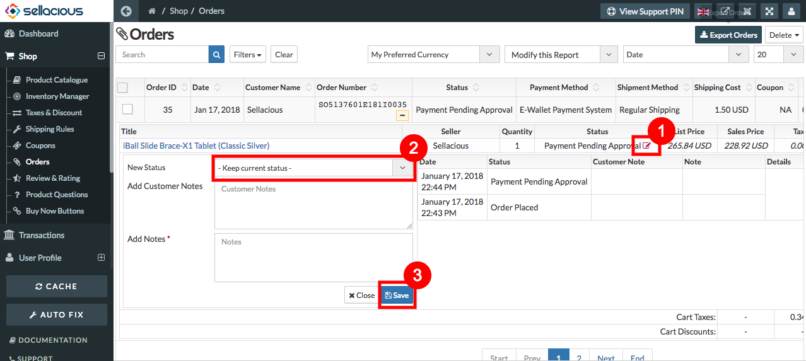
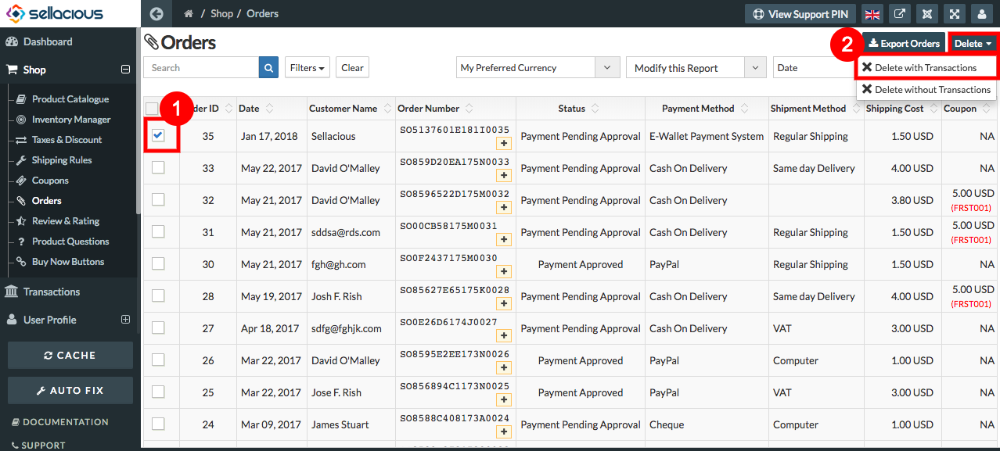
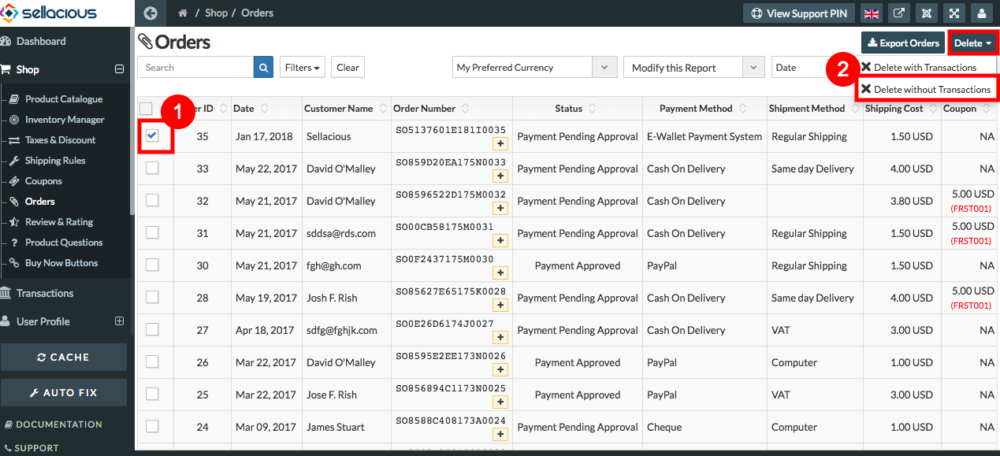
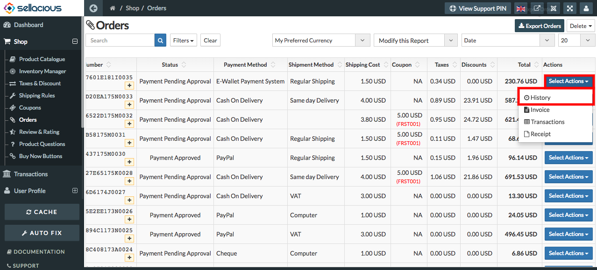
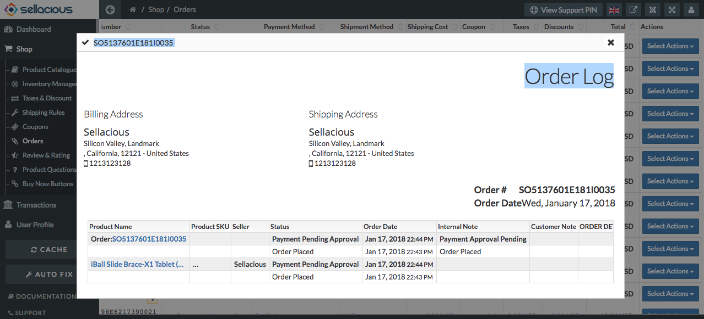
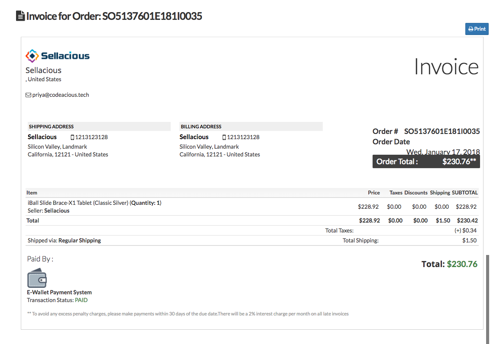
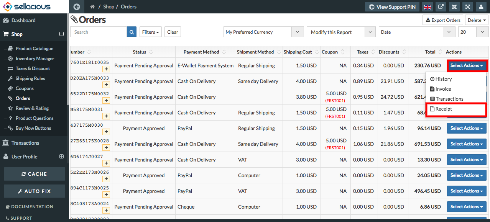
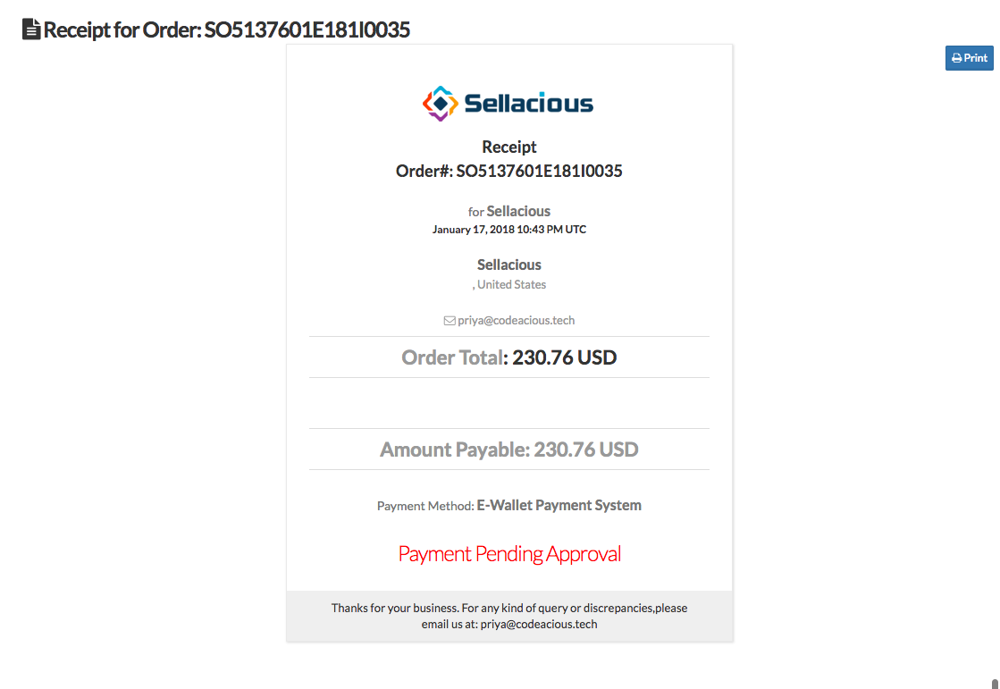

##### **To Edit the status of Order,Follow Steps:**

1. Go to the sellacious admin panel.
2. Go to Shop and select order from the dropped down menu.

3. Ordered Products lists in this section.
a) To Changing order status:
1. Click on the plus icon on the order number for changing the status.

2. click on the edit icon under the status.
3. Edit the status.
4. Click save button to save the edit details.

##### **To delete the orders,follow Steps:**

1. Go to sellacious admin panel.
2. Go to shop and select order from the drop down menu.

3. Select the orders you want to delete from the listed Orders List.
4. Click on delete button on the top
   	* **Delete with transactions :** If you want to delete the order with transactions select Delete with                   Transactions option.

	

   	* **Delete without Transactions :** If you want to delete the ****order without transactions select Delete               without Transactions option.

	

5. And Order will successfully deleted.

##### **To see History Details of Orders,Follow Steps:**

1. Go to sellacious admin panel.
2. Go to shop and select order from the drop down menu.

3. Go to Actions Column Of Orders.
4. From Select Actions dropped down menu select History.

5. And You can check selected order History.

##### **To take Invoice and Receipt Printout,Follow steps:**

1. Go to sellacious admin panel.
2. Go to shop and select order from the drop down menu.

3. Go to Actions Column Of Orders.
4. From select Actions dropped down menu select,
	a) Invoice : To take printout as Invoice click on invoice.
    
    
    
    
    b) Receipt : To take printout as receipts click on Receipt.
    
    
    
    
   
    
##### **To View Transaction Of an Order,Follow Steps:**

 If the payment status is approved then it will be listed on the transactions menu in the sellacious backsite.

 