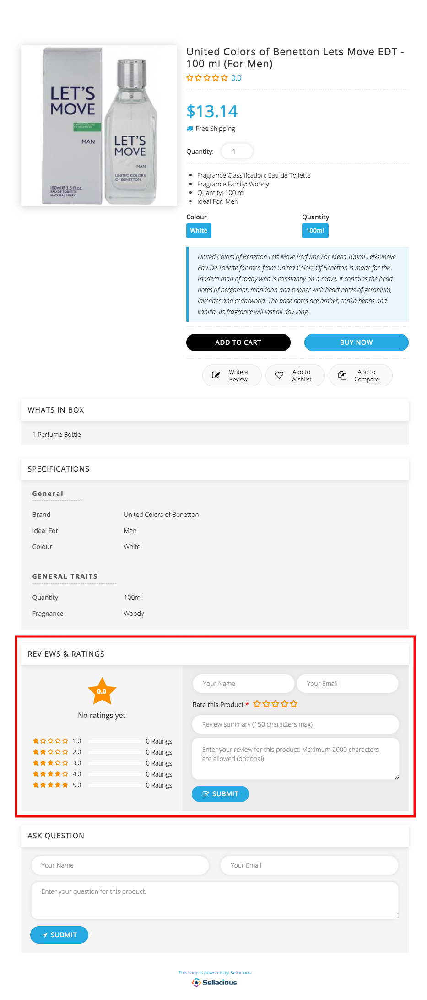
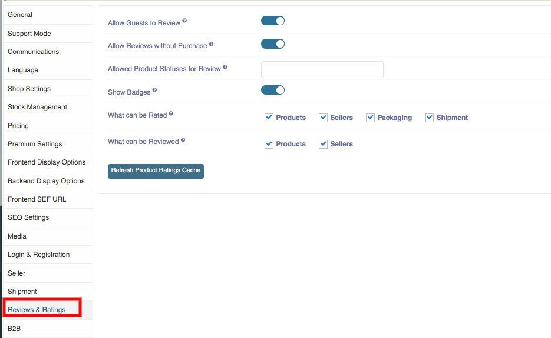

* Review and Ratings empowers the customers to share their opinions and experiences, wherever they shop and enables you to reach more people and influence more purchases. 
* Review and Rating is the detailed list view which will submitted by the customers. 
* Customers can review and rate the Products from thr frontend. 

* Users can manage, who can review and rate the products. These settings can manged by global settings in backend. 

**Rating**: A rating is an evaluation or assessment of something, in terms of quality, quantity, or some combination of both. Rating is the scale which is submitted by the customers based on their satisfaction.THe rating start from 1 to 5. Customers can give the ratings to Products from the frontend.

**Review**: Customers can give their reviews by commenting on Product from the frontend.It help sellers understand how consumers really feel about their Product. 
