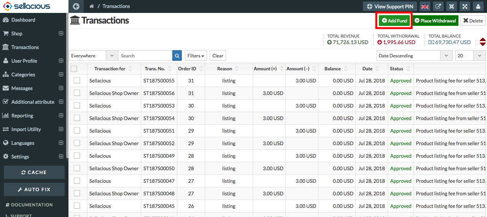
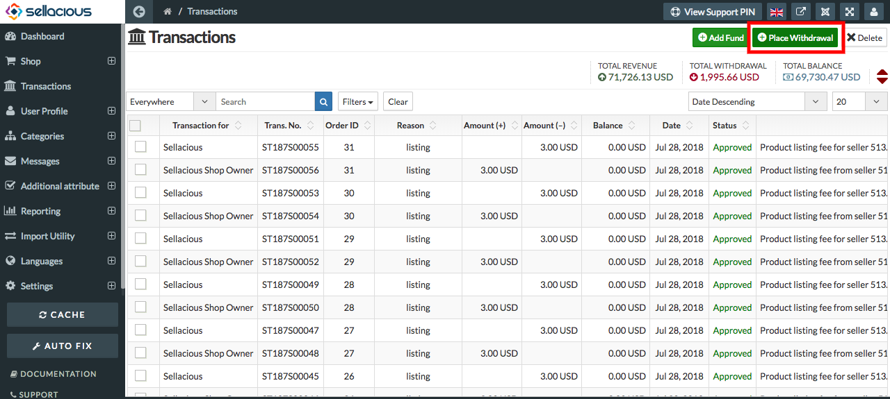
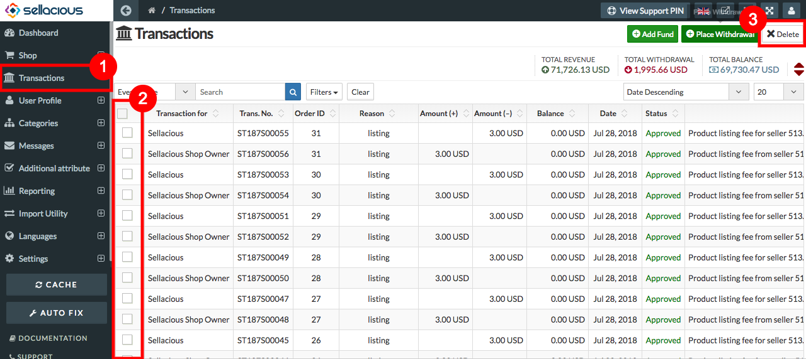

##### **User can manage the transaction by adding and withdrawing the funds:**
 
a) To add fund, select transacation menu from the left Menubar and click on **add fund** button from the top.

b) To withdraw funds, select transactions menu from the left Menubar and click on **withdraw fund** button from the top.

##### **To Delete the Transactions, Follow steps:**

1. Go to sellacious admin panel.
2. select transactions menu from the left menubar.
3. select the transaction you want to delete.
4. Click delete option from the top.
5. And your selected transactions will be deleted.

##### **To Filter the transactions,Follow steps:**

1. Go to sellacious admin panel.
2. Select transaction menu from the left Menubar.
3. Click on the filters.
4. Fill the Filters credentials according your need.
 **Select type**:  The filter can be added in type of the transaction. you can search or apply the filter according to the type as withdrawal, add fund, listing fee, currency exchange, Taxes, Discount, Commission and all other.
 **Select status**:  The status of the transaction is to be filtered. The current status of the transaction you used while adding the fund or while withdrawing the fund from your account. It can be pending, approved, locked, Disapproved and cancelled.
 **Select start date**:  The filter to check the transaction from a particular date. When you click on the calendar icon the calendar will be appeared with date.For example you want to check the transaction from 24 May 2018 then select the date according to the format year-month-day.
 **Select end date**: The filter to check the transaction till a particular date. When you click on the calendar icon the calendar will be appeared with date. For example, You want to check the transaction till 24 june 2018 then select the date according to the format year-month-day. 
 **Date descending**:List all the products  according to the ascending & descending order as Order Id, Reason, Amount(+), amount(-),date, status,notes and balance and status are also can be checked from here.

