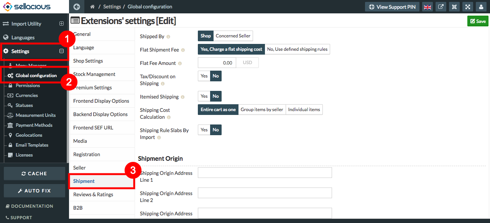
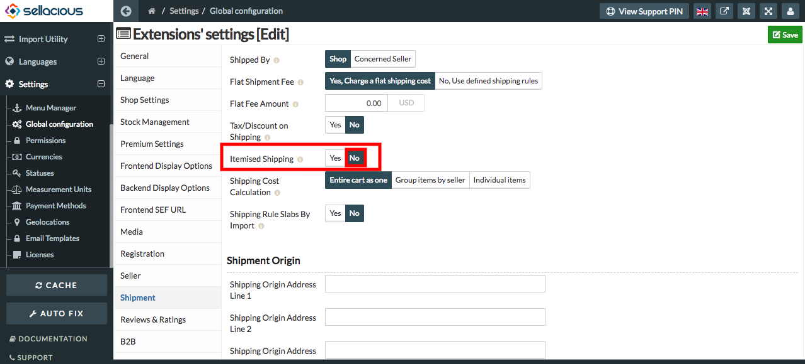
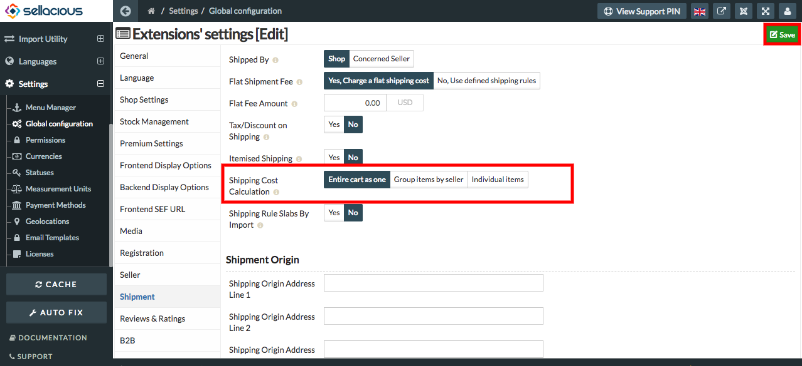

To set the Individual and Cart rule, Follow Steps:

1. Go to the sellacious admin panel.
2. Go to the settings and select the global configuration from the dropped down menu.
3. Click on the Shipment tab.

4. In the shipment section, Set the itemised shipping as 'No'. It means a user cant add shipping to individual products. 

5. Set the shipping cost Calculation as:  
	**a) Entire cart as one:** You can calculate the shipping cost in entire cart as one. That means you can apply            the shipping cost to all of the products present in the cart. 
    **b) Group items as seller:** If for no. of products there is only one seller, then a user can  set this as a 
         shipping cost calculation.
    **c) Individual Items:** It is used to set shipping cost for individual items.
    

    
6. Click on the save button to save the details.  
  
   