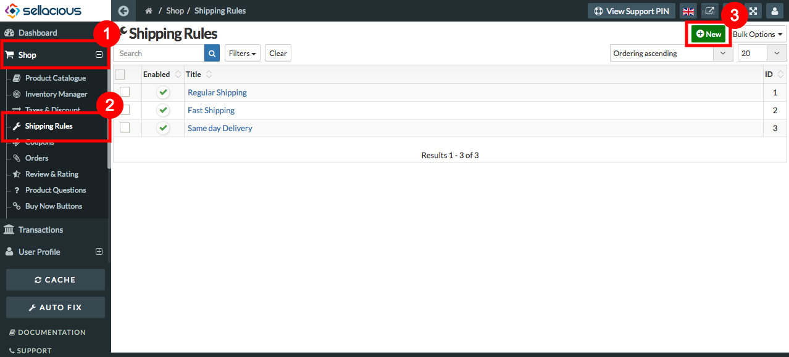
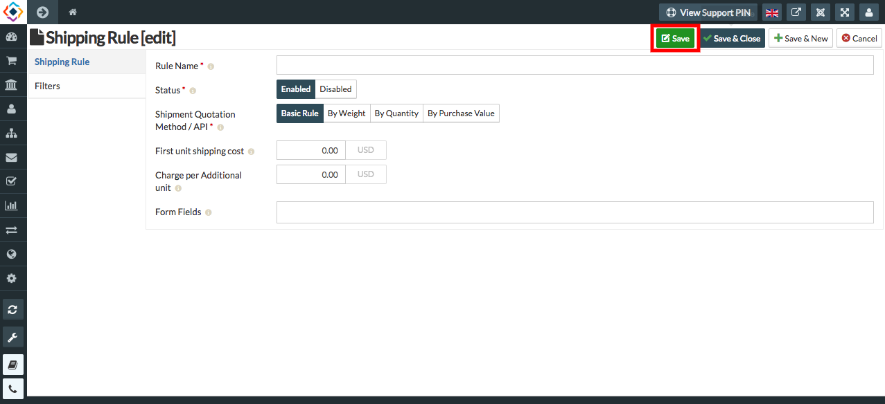

* **Shipping rule are the rules applied to the products while shipping.** 
* **The shipping rules allows you to create sets of rules and conditions that control how your orders are shipped.** 
* **You can set the shipping rule from the global configuration section. Go to the setting -- Global configuration -- Shipment.** 
* **In global configuration you can set, who can ship your product to the customers at Flat shipment fee, Flat shipping cost etc.**

##### **To create a New shipping Rule, Follow Steps:**

1. Go to the sellacious admin panel.
2. For adding shipping rule to your product, Go to Shop.
3. Select Shipping rule from the dropped down menu.
4. Click on new button.

5. Fill the Credentials. 
7. In **Shipping Rule** section- **Rule Name, Status, Shipment Quotation Method/API** text fields are mandatory.
8. Click on save button to save the Shipping rule details.

10. And the new shipping rule is added.
