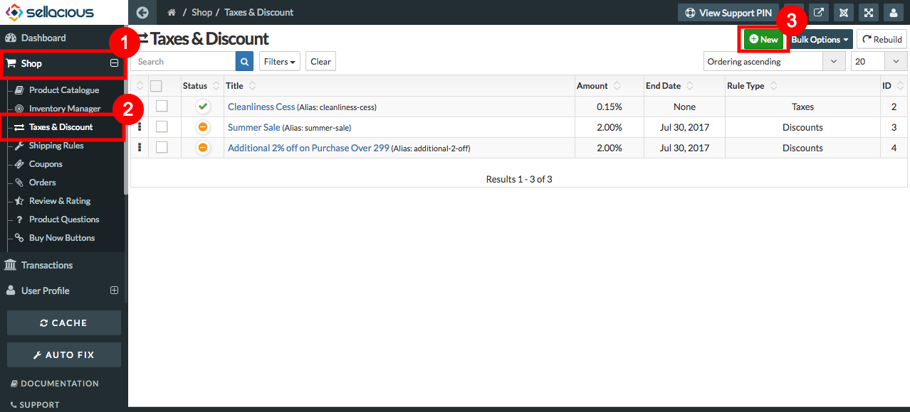
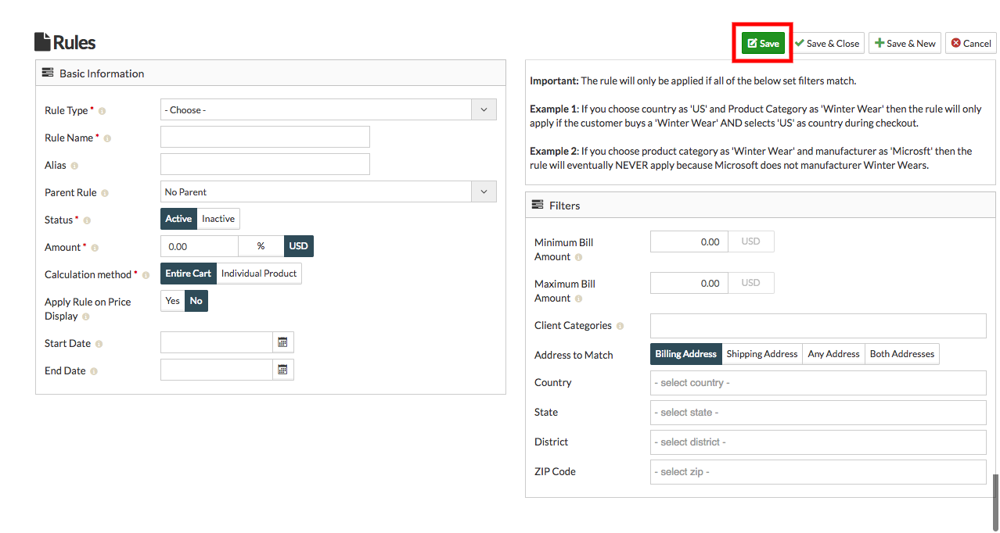

**Tax:** A tax (from the Latin taxo) is a mandatory financial charge or some other type of levy imposed upon a taxpayer (an individual or other legal entity) by a governmental organization in order to fund various public expenditures. In simple words it is an amount of money that you have to pay to the government so that it can pay for public services.  
**Discount:** Discount can be also referred to as a deduction in price. The seller deducts the discount from the gross or total price, and the buyer is supposed to pay the net amount. 
An offer based on the total value of a shopping cart is an effective upselling tactic to encourage customers to spend more, increasing your average order size. One can also offer minimum purchase discounts for specific collections and products.

##### **To create Tax and Discounts, Follow Steps:**

1. Go to the sellacious admin panel.
2. For adding Taxes and discount to your product, Go to Shop and select Taxes and Discount from the dropped down        menu.
3. click on new button.

4. Fill the credentials in tax and discount, Rules section.
5. Click on save button to save the details.

6. Created taxes and discounts successfully added to your product.
