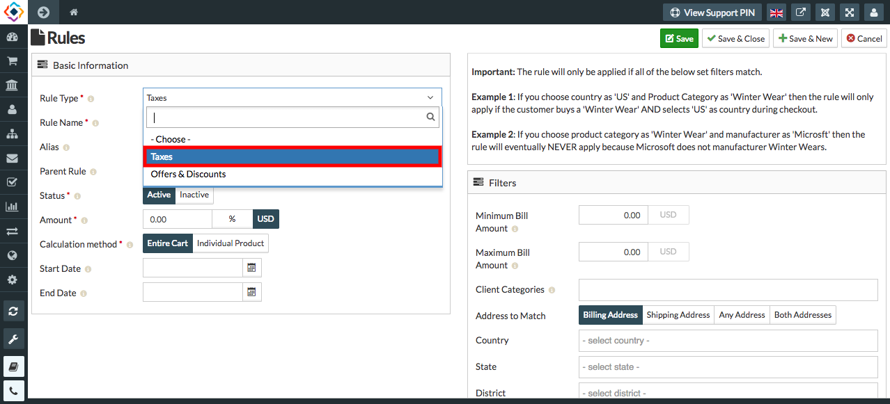
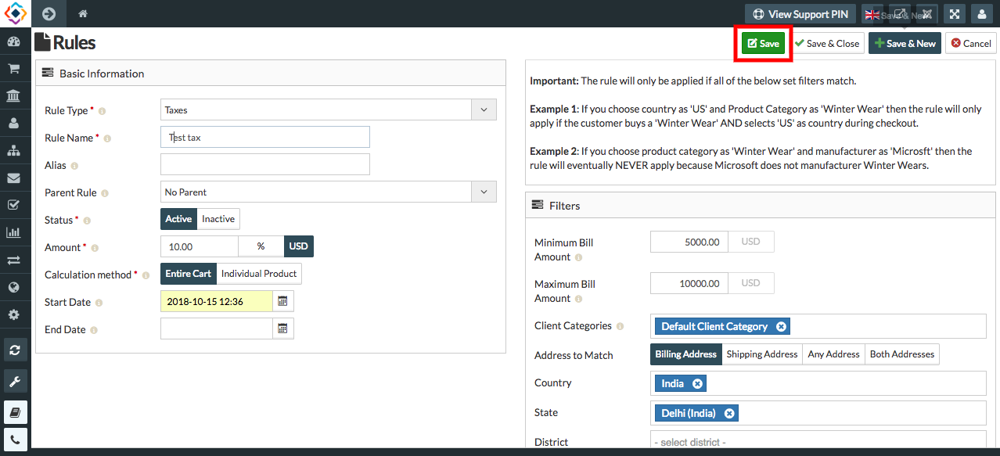

##### **To Create Taxes, follow Steps:**

1. Go to the sellacious admin panel.
2. For adding Taxes to your products, Go to Shop.
3. Select Taxes and Discount from the dropped down menu.
4. Click on new button.

5. In the Rule Type Text field select Taxes from the drop down menu to create Taxes for the Products.

6. In Rules section- Rule Type, Rule Name, Status, Amount, Calculation Text fields are mandatory.
7. Fill the credentials.
8. Click on save button to save the created tax details.

 
9. You can create other taxes by using above method.

