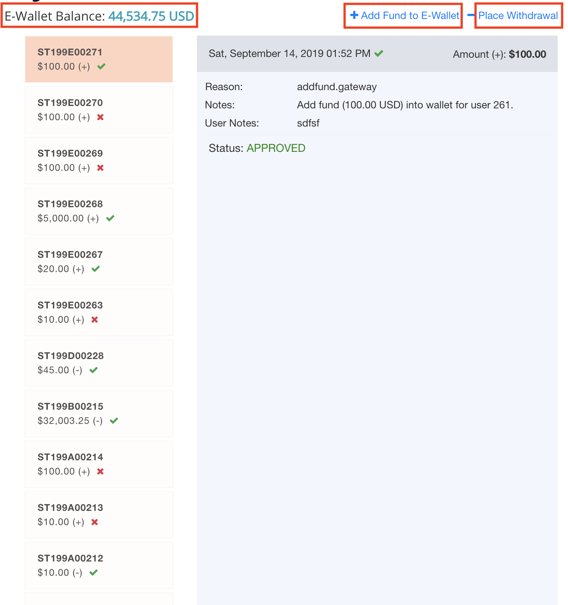
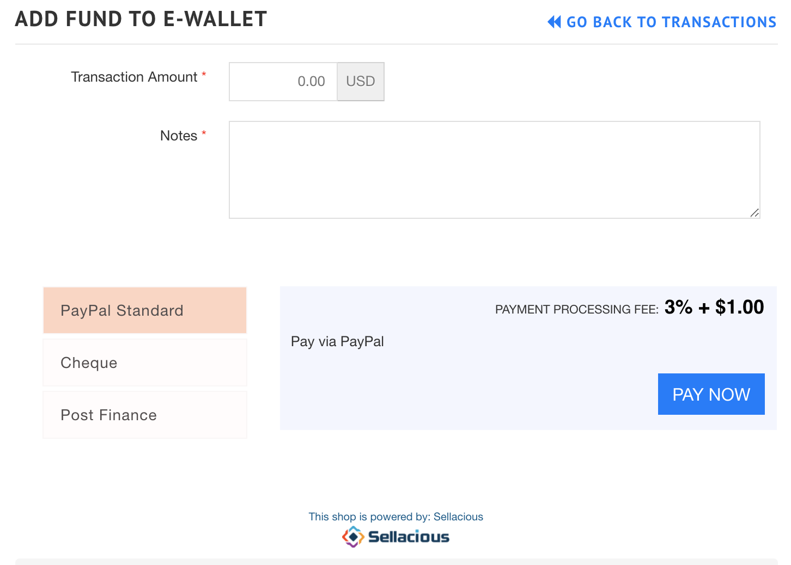

**Written by:** Indresh Maurya
**Date:** 27-05-2020
**Compatibility:** Sellacious v2.0.0-Beta1+

Frontend transaction view(menu can be created) is added to sellacius which provides frontend capability to view transactions, recharge User Ewallet, place withdrawals.

1. To create Frontend transaction menu go to **Joomla Backend->Menus->New** and choose **Sellacious->User Transaction** in menu type.

2. User need to have permission to see transaction, to grant permission go to Settings->Permissions select User Category-> Everyone and Componenet->sellacious. Under **Transactions, Add Fund, Withdrawal** section Allow relavant permissions. 

3. Now frontend transaction view is available for the user

4. Amount can be added in user ewallet using available payment methods and withdrawl can be placed

