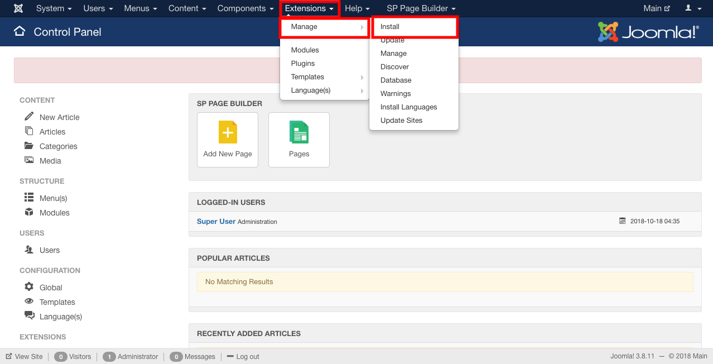
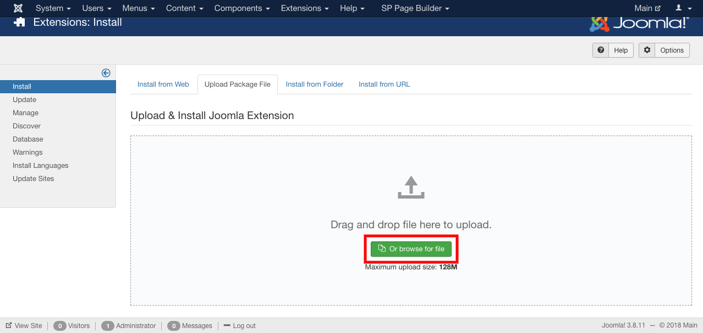
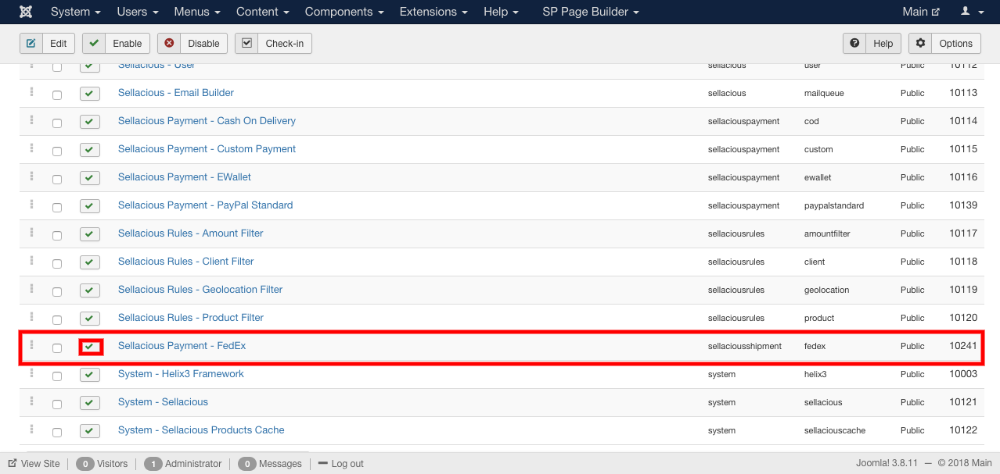
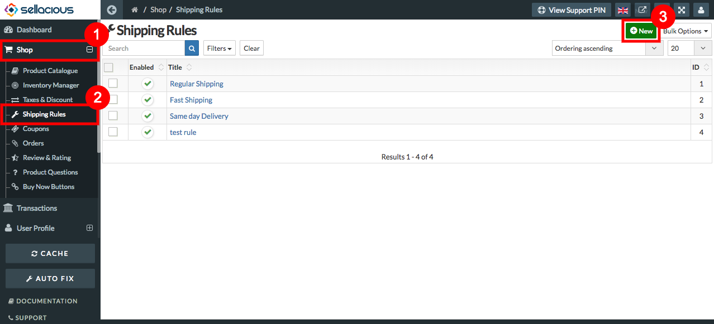

##### **To Add Shipping Methods, Follow steps:**

1. For adding Shipping method, Download the shipping methods from https://www.sellacious.com/apps-and-integrations.
2. Enable the plugin from the frontend.
3. Install the downloaded shipping method on the joomla administrator by extensions-> Manage-> Install.

4. Installed shipping method is added to your shop.
5. Now to apply, publish the installed shipping method .
6. To Publish:
   **Go to extensions--Plugins--enable the installed plugin.**
   

##### **To apply installed shipping method to the shipping rules:**

1. Go to the sellacious admin panel.
2. Go to the shop and select Shipping rules from the dropped down menu.
3. Click on New button, to apply shipping method to new rules otherwise open the existing one.

4. Fill the credentials.
5. In Shipment Quotation Method/API select the installed shipping method.
6. Click on the save button to save the details.

7. And installed shipping method is assigned to the shipping rule.

   
