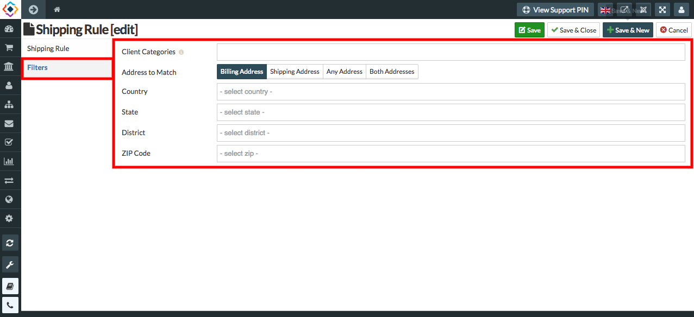
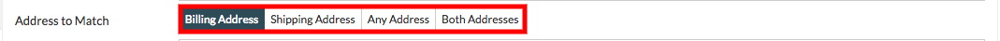

##### **Filters used in making a Shipping Rule.**
* **Client Cateories**
* **Address to match**
* **Country**
* **State**
* **District**
* **ZIP Code**

* **Client Category:** In this text field you can set a client category who can use this rule for the shipment of        products. 
* **Address to match:** Here you can select any address from the options, for shipping the products.

* **country:** Here you can select the country, where you are able to ship the products.
* **State:** In this text field select the state, Where you can ship the products.
* **District:** In this text field select the District, want to ship the products.
* **ZIP Code:** Enter the ZIP code where you can ship the products.
