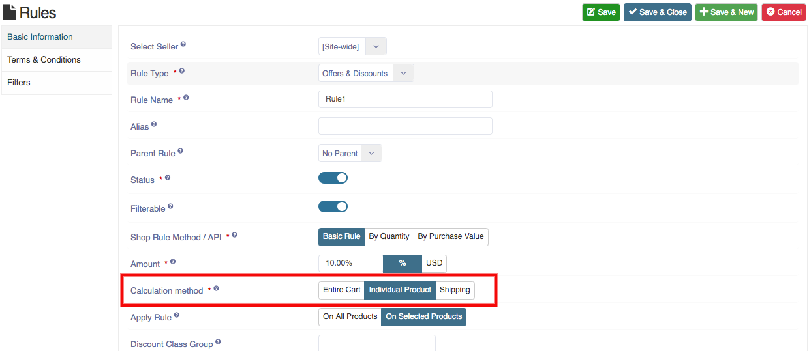
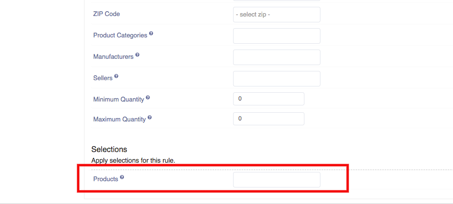

1. Go to the Sellacious panel of your website.
2. For adding Discounts to your inventory, go to Shop and select Taxes and Discounts from the dropped down menu.
3. To create a new Disount, click on New button.
4. Fill the information about the Discounts in different sections available in the window.
	a) You can apply the filters for the products by setting the calculation method as Individual cart.
    b) Now go to the filters tab you can add the product filters.
5. Click on Save button to save the details, the Disount is successfully added to your inventory.
