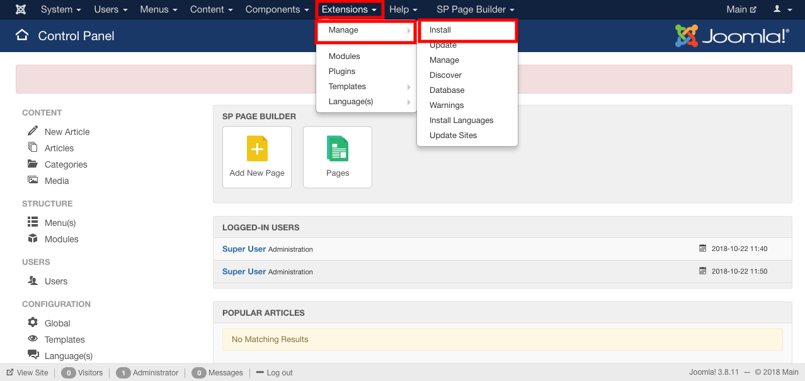
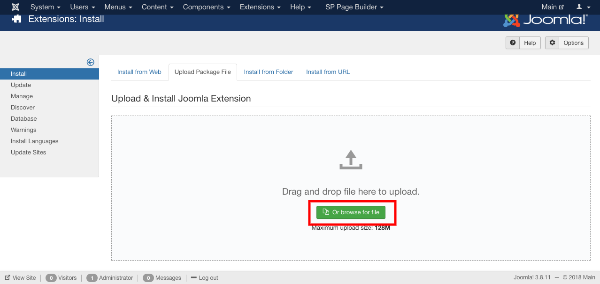
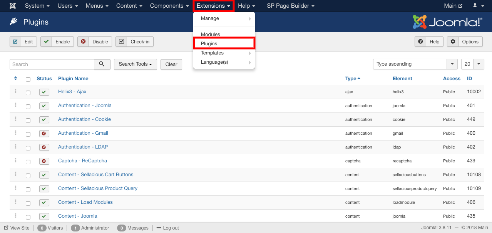

##### **To Install New Payment Gateway Plugin, follow steps:**

1. Download a new Payment Gateway.
2. To install that Payment Gateway Plugin:
3. Go to joomla administrator.
4. Go to extensions-> Manage-> Install.

5. Upload the downloaded Payment Gateway.

6. Enable the created Payment Gateway.
7. Go to extentions-> Plugin.

8. Enable the installed Payment gateway Plugin.
9. And the downloaded Payment gateway Plugin is installed.

##### **After Installing new Plugin you can create a new Payment Method using the installed Plugin.
**
