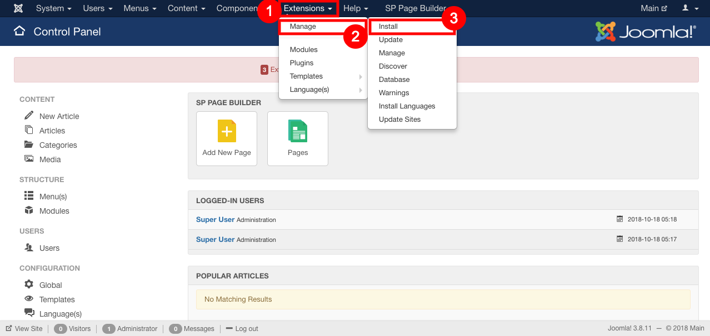
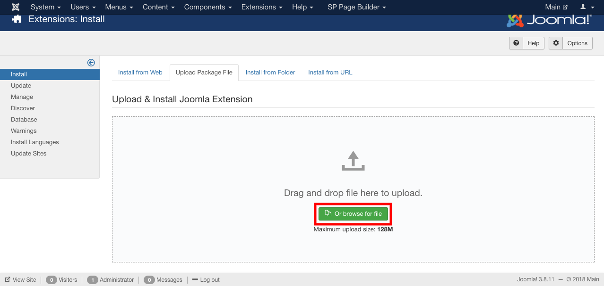
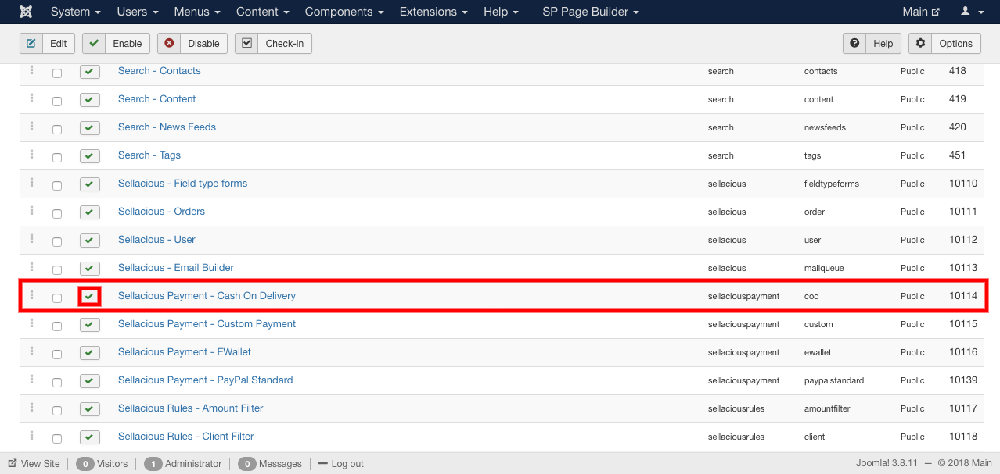
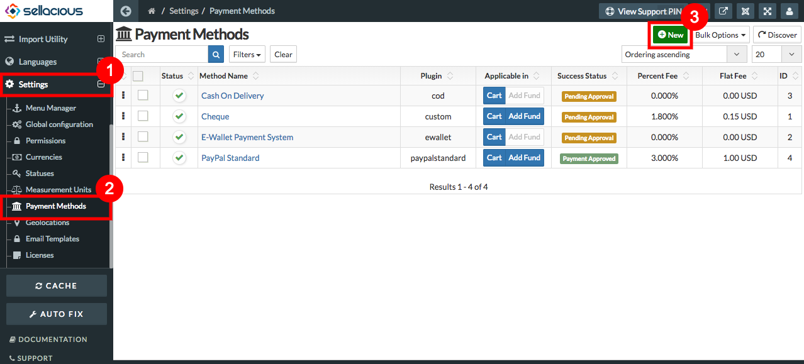
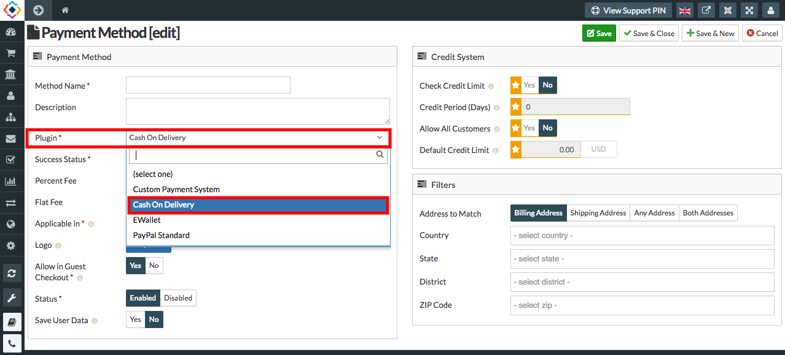

**COD stands for Cash On Delivery.** 
Cash on delivery (COD) is a type of transaction in which the recipient makes payment for a good at the time of delivery. If the purchaser does not make payment upon delivery, the product is returned to the seller.

##### **To Add COD Payment Method, Follow steps:**

1. For adding COD Payment method, Download the COD method first.
2. Enable the plugin from the frontend.
3. Install the downloaded COD method on the joomla administrator by extensions-> Manage-> Install.

4. Installed COD method is added to your shop.

5. Now to apply, publish the installed COD method .
6. To Publish: Go to extensions--Plugins--enable the installed plugin.

##### **To Create new Payment method using COD Plugin, Follow steps:**

1. Go to the sellacious admin panel.
2. Go to settings, select Payment method from the dropped down menu.
3. click on new button to create new payment method using COD Plugin.

4. In Payment method section, go to plugin column.
5. In Plugin Column select COD Plugin from the drop dowm.

6. Fill credentials.
7. In the payment section- Method Name, Success status, Plugin, Applicable in, Status Text fields are mandatory.
8. click on save button.
9. New payment method using COD Plugin is created.

