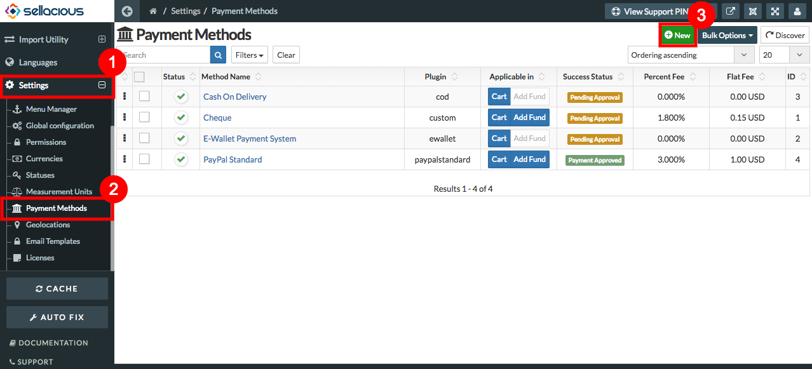

##### **To Create new Payment Methods, Follow Steps:**

1. Go to the sellacious admin panel.
2. Go to Settings and select payment method from the dropped down menu.
3. To create a new payment method, click on new button.

4. Select the plugin for which you want to create the Payment method.
5. Once the plugin is selected, fill its credentials for sandbox or live mode.

7. In payment Method section- Method name, Plugin, Success status, Applicable in, Allow in Guest checkout, Status      Text fields are mandatory.
8. click on the save button to save the payment method details.

7. And new Payment method is added.
