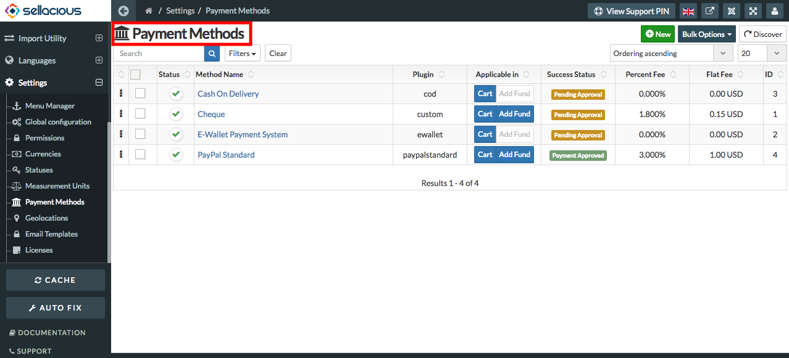

**The way that a buyer chooses to compensate the seller of a good or service that is also acceptable to the seller.** 
**Typical payment methods used in a modern business context include cash, checks, credit or debit cards, money orders, bank transfers and online payment services such as PayPal.**

##### **To create a new Payment Method, Follow steps:**

1. Go to the sellacious admin panel.
2. Go to Settings and select payment method from the dropped down menu.
3. To create a new payment method, click on new button.
4. Fill the credentials in different sections available in the payment method tab.
5. click on save button to save the  payment method details.
6. and the new payment method is added.
