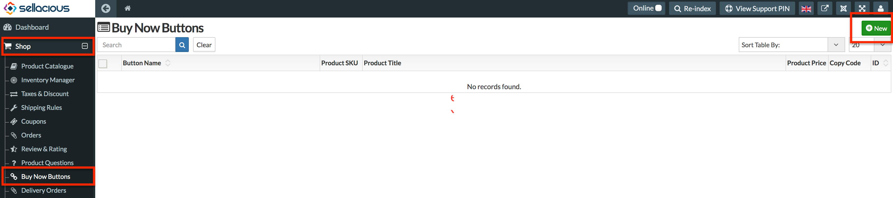

There are two types of Buy Now buttons in sellacious.  

## 1. **New Buy Now Buttons:**  

For these type of buttons you don't need to create any product in sellacious. You can directly create these buttons from Sellacious Backend.

To create buy now buttons, go to **sellacious Backend > Shop > Buy Now Buttons**.  

Click on **New** button on the right top of the page to create an Buy Now Buttons.

The view will open to create sellacious buttons. Fill all the fields.  

* Select **Buy Now** in button section to create Buy Now Buttons.
* After submitting all the details, you get a code below the settings. This is the code for the button. 

* Save these settings. Button is created and you can see it in the List.  

Now, to publiush this button on your site/frontend, you can either paste this code in an [Article](https://docs.joomla.org/Adding_a_new_article) or create a [Custom HTML module](https://docs.joomla.org/Help39:Extensions_Module_Manager_Custom_HTML).

Below is the image of this **Buy Now** button in custom HTML module and Article.

---

## 2. **Buttons For already created Products:**  

In sellacious you can use buttons of already created products too. In Product List there's a column for Button Codes. You can copy Buy Now button code from there and use it. 

The code copied for buy now button of the product will be like this `[sellacious.cart.buy=P1V0S323;btn btn-success;Buy Now]`. Paste this code in Article or Module. And it would look like this.

> In module make sure to select 'Prepare Content' to show the button.
> 