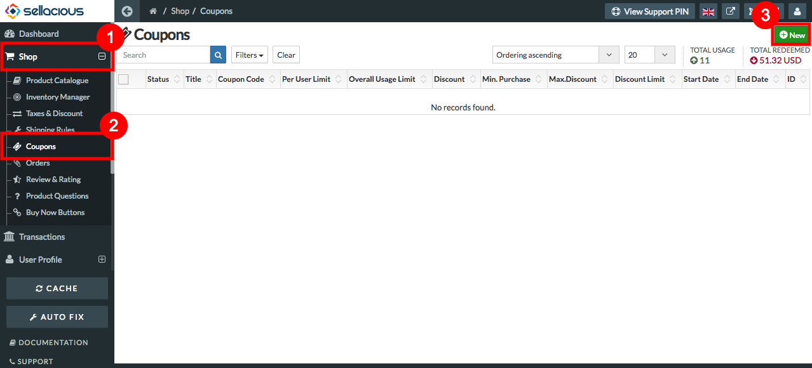
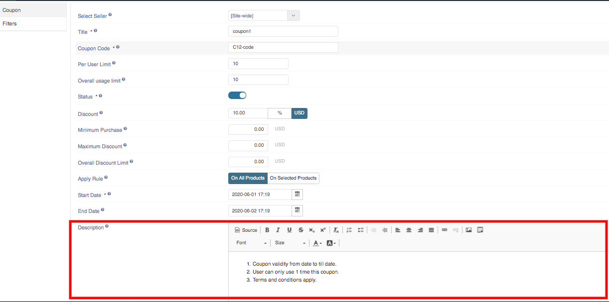
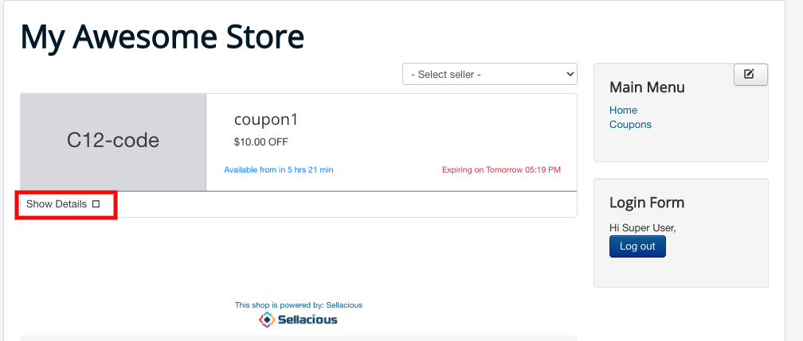

**To add Coupon description, follow the below steps:**

1. Go to the sellacious admin panel of your website.
2. Go to Shop and select Coupons from the drop-down menu.
3. To create a new coupon, click on new button.

4. Fill all the nesessary details and also at the bottom of the page, you can find description box.

5. You can enter your description related to your coupon and save the coupon.

6. Click on the Show Details link.

7. Now, you can see the coupon description here.

