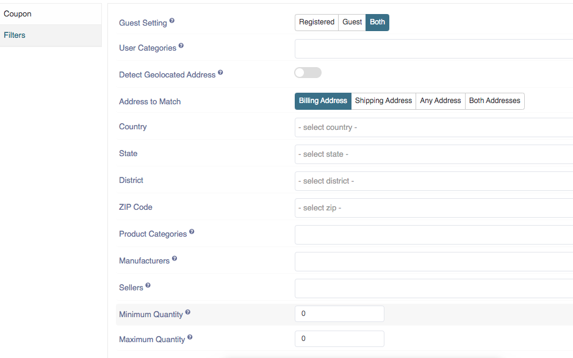

##### **Coupon Filters**

**client categories**: 
Select specific client categories for which this rule to apply. Leave empty to apply for all client categories. Select the client categories listed in the drop down menu.

**Address to match**: 
Choose the address to match for which this rule is to be apply.The Address of match is the Billing address, Shipping address, any address and Both addresses.

**country**: 
Select the name of the country for which the coupon is to be apply. When you type the first two letters then drop down list of the country name will be appeared.

**State**: 
Select the name of the state for which the coupon is to be apply. When you type the first two letters then drop down list of the state name will be appeared

**District**: 
Select the name of the district for which the coupon is to be apply. You can purchase the geolocation for the better searching of the district.

**ZIP code**: 
Select the ZIP code for which the coupon is to be applied.You can purchase the geolocation for the better searching of the ZIP code.

**product categories**: 
select specific product categories for which this coupon to apply. Leave empty to apply for all product categories.

**Products**: 
Select specific products for this coupon to apply. Leave empty to apply for all products. You can select multiple products from here. The products you want to apply the coupon. 

**manufacturers**: 
Select the manufacturers for whose products this coupon shall apply. Leave empty to apply for all manufacturers.

**minimum quantity**: 
Enter the minimum quantity for the shipping coupon to apply. Zero means no rules had applied. You can enter the amount via by using the scroll down menu.	

**maximum quantity**:
Enter the maximum quantity for the shipping coupon to apply. Zero means no rules had applied.You can enter the amount via by using the scroll down menu.
