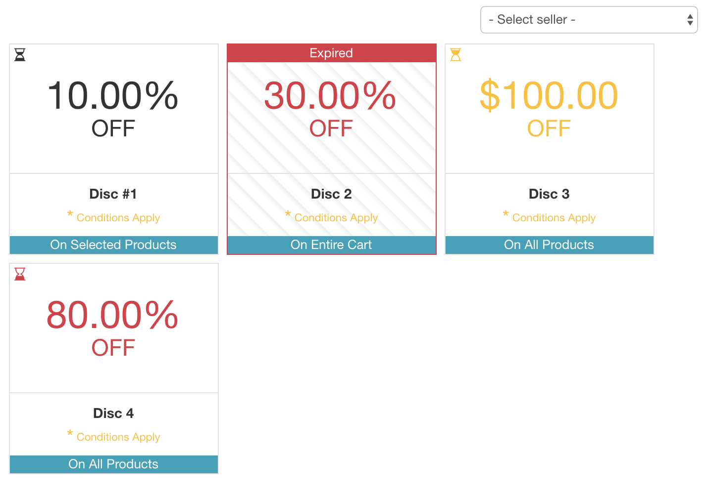
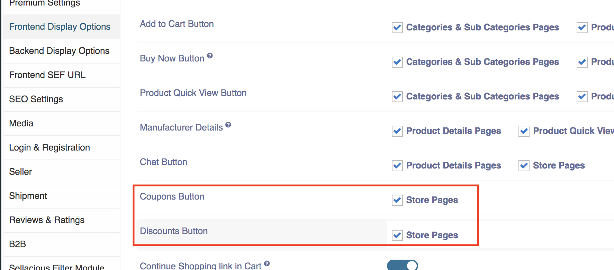
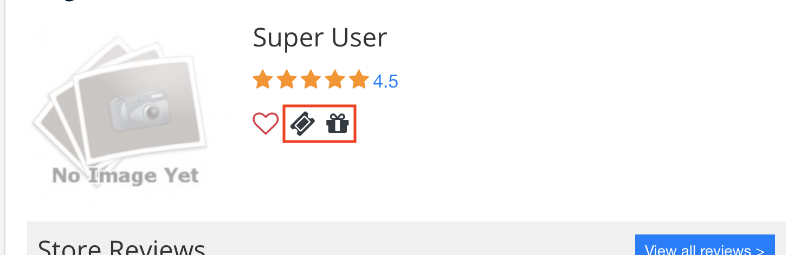

**Written by:** Indresh Maurya
**Date:** 26-05-2020
**Compatibility:** Sellacious v2.0.0-beta1+

New view (menu) is added to show coupon and discoints, also there are configuration to show coupon and discount on Store Page.

1. To make coupon and discount menu go to Joomal Backend->Menu. Create new and select Sellacious->Coupons/Shoprules in menu type.

oncce published coupons and disconts will show on frontend.

2. These coupons can be shown on sellers store page. To enable this go to Settings->Global Configuration->Frontened Display Options and enable coupons and discount for store page

3. Now coupon and discount icon will show on store page and when clicked it will redirect to corresponding views.

