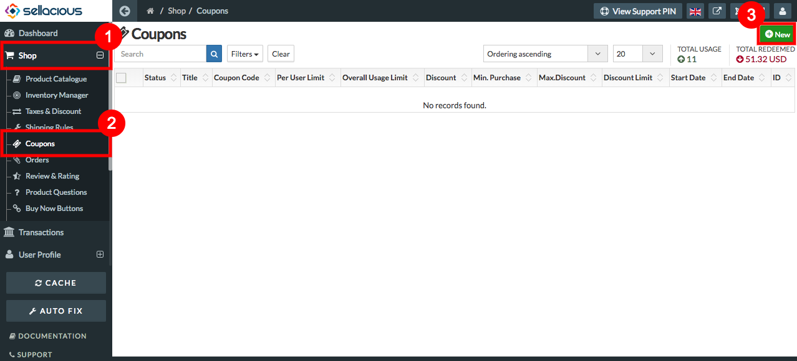

##### **To Create Coupons, Follow steps:**

1. Go to the sellacious admin panel.
2. Go to Shop and select Coupons from the dropped down menu.
3. To create a new coupon, click on new button.

4. Fill the credentials.
6. In Coupon(edit) section Title, Coupon code, Status and Start Date Fields are mandatory.
7. Click on save button to save the Coupon details.

9. And Coupon is created successfully.
10. You can create other coupons by using above method.
