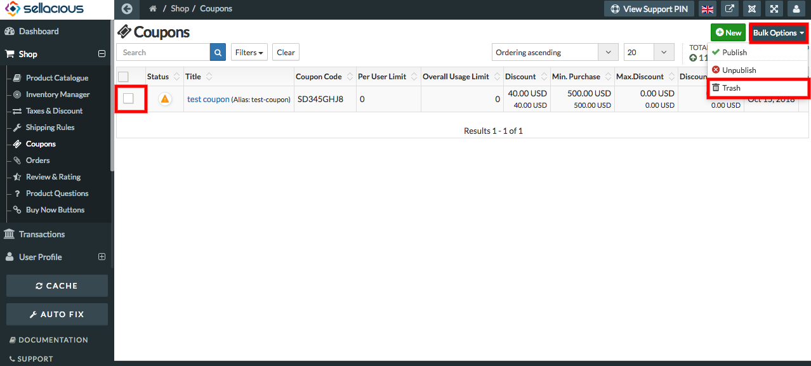
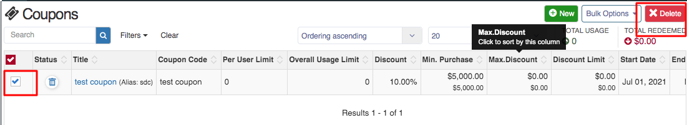

##### **To Delete Created Coupons, Follow Steps:**

1. Go to the sellacious admin panel.
2. Go to Shop and select Coupons from the dropped down menu.
3. select the coupon you want to delete.

4. Click on the bulk actions, and from the drop down menu select trash.

5. Slected coupon will move to Trash now.
6. Go to the search filters and In the select Status Option select Trashed.

7. Select coupon you want to delete permanently from the trashed coupons.
8. Click on delete button on right side.

9. Selected coupon is deleted successfully.

