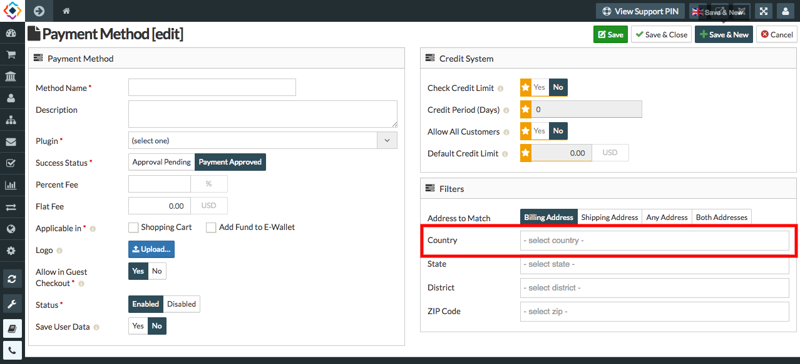

##### **To Create Country Wise Payment Methods, Follow Steps:**

1. Go to the sellacious admin panel.
2. Go to Settings and select payment method from the dropped down menu.
3. To create a country wise payment method, click on new button.

4. Fill the Credentials.
5. In payment Method section- Method name, Plugin, Success status, Applicable in, Allow in Guest checkout, Status      Text fields are mandatory.
6. To create country wise payment method, mention country in Country Text field.
7. click on save button to save the  payment method details.

8. And new Payment method is added.
